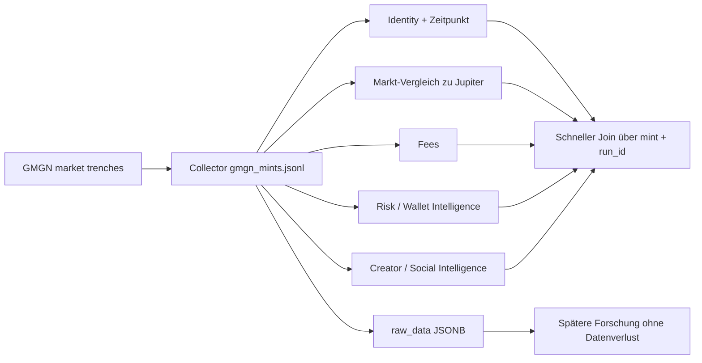
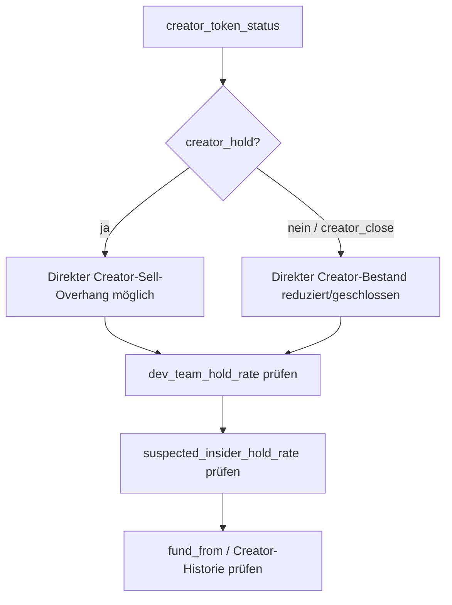

# GMGN Trenches – Feldreferenz für `gmgn_mints.jsonl`

> **Stand:** 2026-08-08  
> **Zweck:** Fachliche Referenz für die von `market trenches` gelieferten GMGN-Daten im Projekt `jupiter-data-transform`.  
> **Wichtig:** Diese Datei ist **keine Empfehlung, alle Felder zu normalisieren**. Für schnellen Zugriff kann eine kleine Auswahl als SQL-Spalten dienen; der vollständige GMGN-Datensatz bleibt in `raw_data`/JSONB erhalten.

## 1. Datenbasis und Vertrauensstufen

Die hochgeladene Beispieldatei enthält **16 JSONL-Records**, **17 `raw_records`** und **118 unterschiedliche Felder** innerhalb von `raw_records[*].data`. Ein Mint erscheint in zwei Trenches-Buckets mit identischem `data`-Inhalt.

Die Bedeutungen unten werden bewusst nach Vertrauensstufe getrennt:

| Kennzeichen | Bedeutung |
|---|---|
| **D – dokumentiert** | Bedeutung ist in der aktuellen offiziellen GMGN-Skills-/CLI-Dokumentation beschrieben. |
| **A – ableitbar** | Bedeutung ist aus Feldname, benachbarten offiziellen Feldern und beobachtetem Werteformat plausibel, aber nicht ausdrücklich für dieses konkrete Feld dokumentiert. |
| **U – unklar** | Keine belastbare öffentliche Definition gefunden. Nicht semantisch auswerten, sondern nur als Raw-Daten bewahren. |

### Relevanz für dieses Projekt

| Stufe | Bedeutung |
|---|---|
| **Kern** | GMGN liefert hier einen echten Zusatznutzen gegenüber Jupiter oder das Feld ist für Source-Vergleiche zentral. |
| **Optional** | Für spätere Analysen interessant, aber kein zwingender Schnellzugriff. |
| **Raw** | Im JSONB behalten; zunächst keine eigene SQL-Spalte nötig. |



---

## 2. Collector-Wrapper – nicht direkt GMGN

Diese Felder werden vom lokalen Collector um die GMGN-Antwort gelegt.

| Feld | Bedeutung | Relevanz |
|---|---|---|
| `run_id` | Startzeit/ID des Collector-Runs. In der aktuellen Implementierung ein ISO-Zeitstempel. | **Kern** – zusammen mit Mint geeignete Observation-Identität. |
| `collected_at` | Zeitpunkt, zu dem der Mint in diesem Run erfasst wurde. | Optional; meist nahe an `run_id`. |
| `mint_address` | Eindeutige Solana-Mint-Adresse. | **Kern** – Join-Schlüssel zu Jupiter. |
| `source` | Collector-Quelle, aktuell z. B. `trenches`; perspektivisch auch `signal`. | **Kern** – Herkunft der Observation. |
| `first_query` | Interne Query-ID des Collectors (`q0001`, ...). | Raw; operationales Debugging, fachlich kaum relevant. |
| `market_cap` | Vom Collector aus der ersten GMGN-Beobachtung hochgezogen. | Optional; dieselbe Information steht zusätzlich im GMGN-`data`. |
| `launchpad_platform` | Vom Collector hochgezogene Plattform. | Raw/Optional. |
| `raw_records` | Eine oder mehrere GMGN-Beobachtungen desselben Mints aus unterschiedlichen Trenches-Buckets. | **Kern als Quelle**, aber nicht als flache DB-Struktur. |
| `raw_records[*].bucket` | Trenches-Lifecycle-Bucket, z. B. `new_creation`, `pump`/near-completion oder `completed`. | Optional; nützlich für Lifecycle-Kontext. |
| `raw_records[*].data` | Eigentliche GMGN-Tokenbeobachtung. | **Kern** – sollte vollständig als JSONB erhalten bleiben. |

---

# 3. Identität, Token und Marktstruktur

| Feld | Bedeutung | Status | Nutzen / Kommentar | Relevanz |
|---|---|---:|---|---:|
| `address` | Token-/Mint-Adresse. | D | GMGN-interne Identität; sollte mit `mint_address` übereinstimmen. | Kern |
| `chain` | Chain-Kennung, hier `sol`. | D | Bei reinem Solana-Datensatz redundant, bei Multi-Chain wichtig. | Raw |
| `name` | Tokenname. | D | Metadatum; attacker-controlled und nicht als Vertrauenssignal verwenden. | Raw |
| `symbol` | Token-Ticker. | D | Metadatum; nicht eindeutig. | Raw |
| `logo` | Logo-URL. | D | Eher Darstellung; `image_dup` ist analytisch interessanter. | Raw |
| `decimals` | Dezimalstellen des Tokens. | D | Technisch relevant, aber Jupiter liefert dies bereits. | Raw |
| `total_supply` | Gesamtmenge des Tokens. | D | Jupiter deckt Supply ebenfalls ab. | Raw |
| `standard` | Beobachtet z. B. `2022`; sehr wahrscheinlich Tokenstandard (bei Solana typischerweise Token-2022 vs. klassischer SPL Token). | A | Nicht als harter Contract verwenden, solange GMGN dies nicht explizit dokumentiert. | Raw |
| `creator` | Creator-/Developer-Wallet. | D | Sehr wertvoll für Creator-Cluster und Historie. | Optional |
| `pool_address` | Adresse des Haupt-/zugeordneten Pools. | D | Für Pool-Join/Forensik nützlich; Jupiter hat ebenfalls Poolinformationen. | Raw |
| `quote_address` | Quote-Token des Pools, z. B. SOL oder USDC. | D | Hilft, Liquidität/Markt korrekt einzuordnen. | Raw |
| `exchange` | DEX bzw. Markt, z. B. `pump`, `pump_amm`, Raydium/Meteora. | D | Kontextfeld; vom Namen meist selbsterklärend. | Raw |
| `launchpad` | Launchpad-Identifier. | D | Technischer Identifier, z. B. `pump`. | Raw |
| `launchpad_platform` | Lesbarer/konkreter Launchpad-Typ, z. B. `Pump.fun`, `pump_mayhem`. | D | Gut für Segmentierung nach Launchmechanismus. | Optional |
| `is_og` | GMGN-OG-Klassifikation des Tokens. | A | Offizielle Token-Info kennt `og`; konkrete Trenches-Bezeichnung `is_og` ist nicht separat erklärt. | Raw |
| `status` | Numerischer Status im Raw-Trenches-Datensatz. | U | Nicht mit `launchpad_status` gleichsetzen, obwohl die Werte ähnlich wirken können. | Raw |
| `seq_index` | Interner Sequenz-/Sortierindex. | U | Vermutlich Backend-/Ordering-Metadatum. | Raw |
| `creation_tool` | Vermutlich Tool/Mechanismus, mit dem der Token erstellt wurde. | U | Keine belastbare offizielle Semantik gefunden. | Raw |
| `offchain` | GMGN kennzeichnet, ob es sich um einen „offchain token“ handelt. | D | Offiziell benannt, aber die genaue fachliche Abgrenzung wird nicht weiter erklärt. | Raw |

---

# 4. Lifecycle und Zeitfelder

| Feld | Bedeutung | Status | Nutzen / Kommentar | Relevanz |
|---|---|---:|---|---:|
| `created_timestamp` | Token-Erstellzeit, Unix-Sekunden. | D | Grundlage für Tokenalter. | Optional |
| `created_timestamp_us` | Erstellzeit mit Mikrosekunden-Auflösung. | A | Für dieses Projekt meist unnötig genau. | Raw |
| `open_timestamp` | Zeitpunkt des Open-Market-/DEX-Starts. | D | Bei noch nicht migrierten Tokens oft `0`. | Optional |
| `open_timestamp_us` | Open-Zeit mit Mikrosekunden-Auflösung. | A | Meist kein Schnellzugriff nötig. | Raw |
| `complete_timestamp` | Zeitpunkt, zu dem die Bonding Curve abgeschlossen wurde. | D | `0`, solange nicht abgeschlossen. | Optional |
| `complete_cost_time` | Zeit von Erstellung bis Completion in Sekunden. | D | **Achtung:** Bei nicht abgeschlossenen Datensätzen kann upstream ein negativer Artefaktwert entstehen; nicht blind interpretieren. | Raw |
| `progress` | Bonding-Curve-Fortschritt von 0 bis 1; `1` entspricht abgeschlossen. | D | Sehr gut zur Lifecycle-Segmentierung. | Optional |
| `is_token_live` | Boolean mit unbekannter genauer Bedeutung im Trenches-Rawformat. | U | Nicht automatisch als „Pump.fun-Livestream aktiv“ interpretieren. | Raw |
| `start_live_timestamp` | Startzeit eines nicht näher dokumentierten „live“-Zustands. | U | Zusammen mit `is_token_live` nur Raw verwenden. | Raw |
| `end_live_timestamp` | Endzeit des nicht näher dokumentierten „live“-Zustands. | U | Zusammen mit `is_token_live` nur Raw verwenden. | Raw |

---

# 5. Markt, Aktivität und Vergleich zu Jupiter

Diese Felder sind teilweise redundant zu Jupiter. Genau diese Redundanz ist aber nützlich, wenn GMGN und Jupiter gegeneinander geprüft werden sollen.

| Feld | Bedeutung | Status | Nutzen / Kommentar | Relevanz |
|---|---|---:|---|---:|
| `market_cap` | Marktkapitalisierung in USD. | D | Direkter Source-Vergleich zu Jupiter. | **Kern** |
| `usd_market_cap` | Ebenfalls Marktkapitalisierung in USD. | D | In der Stichprobe identisch zu `market_cap`; nicht doppelt normalisieren. | Raw |
| `liquidity` | Aktuelle Liquidität in USD. | D | Source-Vergleich und Slippage-/Reifeindikator. | **Kern** |
| `holder_count` | Anzahl eindeutiger Holder. | D | Source-Vergleich und Reifeindikator. | **Kern** |
| `volume_24h` | Handelsvolumen der letzten 24h in USD. | D | Aktivität und Source-Vergleich. | **Kern** |
| `swaps_24h` | Gesamtzahl der Swaps in 24h. | D | Aktivitätsintensität unabhängig vom USD-Volumen. | Optional |
| `buys_24h` | Anzahl Buy-Transaktionen in 24h. | D | Buy/Sell-Struktur. | Optional |
| `sells_24h` | Anzahl Sell-Transaktionen in 24h. | D | Buy/Sell-Struktur. | Optional |
| `net_buy_24h` | Netto-Buy-Volumen in 24h. | D | Vorzeichen zeigt Netto-Kauf-/Verkaufsdruck. | Optional |
| `new_wallet_volume` | Vermutlich Handelsvolumen, das frischen/neuen Wallets zugeschrieben wird. | A | Potenziell interessant zusammen mit `fresh_wallet_rate`; genaue GMGN-Definition nicht gefunden. | Raw |
| `visiting_count` | Besuchs-/Search-Heat-Zähler in GMGN. | D | Eher Attention-/Popularitätssignal als On-Chain-Fundamental. | Optional |

---

# 6. Fees und Taxes

## Wichtige Unterscheidung

`buy_tax`/`sell_tax` sind **Token-/Contract-Taxes als Rate**. Die Felder `priority_fee`, `tip_fee`, `trade_fee`, `total_fee` sind dagegen Fee-Messwerte. GMGN dokumentiert für Trenches `total_fee` als Filtergröße, veröffentlicht aber in der zugänglichen Feldreferenz **keine vollständige Formel**, wie die vier Fee-Werte aggregiert und zeitlich abgegrenzt werden. Daher sollten sie als **GMGN-eigene Messwerte** gespeichert und nicht selbst rekonstruiert werden.

| Feld | Bedeutung | Status | Nutzen / Kommentar | Relevanz |
|---|---|---:|---|---:|
| `priority_fee` | GMGN-Messwert für Priority Fees. Auf Solana bezeichnet Priority Fee grundsätzlich die zusätzliche Compute-Priorisierungsgebühr; GMGNs Aggregationslogik für dieses Feld ist nicht öffentlich erklärt. | A | Sehr wertvoll als Aktivitäts-/Competition-Signal, aber nicht selbst neu berechnen. | **Kern** |
| `tip_fee` | GMGN-Messwert für Tips. Die genaue Definition/Quelle der Tips im Trenches-Response ist öffentlich nicht ausreichend dokumentiert. | U/A | Als Originalmesswert behalten. | **Kern** |
| `trade_fee` | GMGN-Messwert für Trading Fees; genaue Aggregation/Zeiteinheit nicht öffentlich spezifiziert. | A | Zentral für die geplante Analyse. | **Kern** |
| `total_fee` | Von GMGN als „Total fee“ verwendete Metrik. | D | Zentral; **nicht** aus den drei anderen Fee-Feldern zurückrechnen. | **Kern** |
| `buy_tax` | Buy-Tax-Rate, z. B. `0.03` = 3 %. | D | Auf den Solana-Beispielen überall 0; bei anderen Token/Chains relevanter. | Raw |
| `sell_tax` | Sell-Tax-Rate, analog zu `buy_tax`. | D | Auf Solana-Beispielen 0. | Raw |
| `total_buy_tax` | Zusätzlicher/aggregierter Buy-Tax-Wert im Rawformat. | U | Exakte Abgrenzung zu `buy_tax` nicht dokumentiert. | Raw |
| `total_sell_tax` | Zusätzlicher/aggregierter Sell-Tax-Wert im Rawformat. | U | Exakte Abgrenzung zu `sell_tax` nicht dokumentiert. | Raw |
| `buy_tips` | Nicht ausreichend dokumentiertes Feld. | U | Nicht mit `tip_fee` gleichsetzen. | Raw |
| `fee_params` | Plattform-/Token-spezifische Fee-Parameter; in der Stichprobe `[]` oder `null`. | U | Nicht mit dem offiziell dokumentierten `fee_distribution`-Objekt gleichsetzen. | Raw |
| `bonus_category` | Fee-/Launchpad-Bonuskategorien; GMGN dokumentiert Beispiele wie `creator_reward` und `cashback`. | D | Kontext für Fee-Sharing/Launchpad-Anreize. | Optional |
| `show_sharing_fee` | Vermutlich UI-/Konfigurationsflag, ob Fee-Sharing angezeigt wird. | A | Für Analytics derzeit kaum relevant. | Raw |

---

# 7. Solana-Sicherheit und Ownership

| Feld | Bedeutung | Status | Nutzen / Kommentar | Relevanz |
|---|---|---:|---|---:|
| `renounced_mint` | Mint Authority wurde aufgegeben; es kann über diese Authority kein weiterer Supply gemintet werden. | D | Solana-Sicherheitsbaseline; Jupiter hat vergleichbare Auditinfo. | Optional/Raw |
| `renounced_freeze_account` | Freeze Authority wurde aufgegeben; Creator kann Tokenaccounts nicht mehr über diese Authority einfrieren. | D | Solana-Sicherheitsbaseline; Jupiter hat vergleichbare Auditinfo. | Optional/Raw |
| `burn_status` | **Liquidity-Pool-Burn-Status**, z. B. `burn`. | D | Wichtig: nicht mit verbrannten Dev-Tokens verwechseln. | **Kern** |
| `dev_token_burn_ratio` | Anteil der Dev-Tokens, die verbrannt wurden. | D | Getrennt von `burn_status` betrachten. | Optional |
| `dev_token_burn_amount` | Absolute Menge verbrannter Dev-Tokens. | A | Ergänzung zum Ratio; genaue Einheit nicht separat dokumentiert. | Raw |
| `open_source` | Verifizierungsstatus des Contract-/Source-Codes (`yes`/`no`/`unknown`). | D | Auf Solana weniger aussagekräftig als Mint-/Freeze-Authority; im Sample teils leer. | Raw |
| `owner_renounced` | Ownership-Renounce-Status (`yes`/`no`/`unknown`). | D | EVM-näher; für SOL nicht mit Mint Authority verwechseln. | Raw |
| `is_honeypot` | Honeypot-Erkennung; laut GMGN für BSC/Base relevant, auf SOL leer/nicht anwendbar. | D | **Leeren SOL-Wert nicht als „sicher“ interpretieren.** | Raw |
| `is_wash_trading` | GMGN hat Wash-Trading-Aktivität erkannt. | D | Eigenständiges Manipulationssignal. | **Kern** |
| `rug_ratio` | GMGN Risk Score zwischen 0 und 1; höher = riskanter. GMGN nutzt >0,3 als High-Risk-Schwelle in seinen eigenen Screening-Guides. | D | Kein mathematisch kalibriertes „Rug-Wahrscheinlichkeits-Prozent“; immer mit anderen Signalen kombinieren. | **Kern** |

---

# 8. Holder-Konzentration, Insider, Sniper, Bundler und Bots

Das ist der Bereich mit dem größten zusätzlichen Informationswert gegenüber einer normalen Token-API.

| Feld | Bedeutung | Status | Nutzen / Kommentar | Relevanz |
|---|---|---:|---|---:|
| `top_10_holder_rate` | Anteil des Supplies bei den Top-10-Wallets (0–1). | D | Konzentrationsrisiko; Jupiter besitzt ähnliche Information. | Optional |
| `dev_team_hold_rate` | Anteil des Supplies, den GMGN als Dev-Team-Wallets klassifiziert. | D | Besser als nur die direkte Creator-Wallet. | **Kern** |
| `creator_balance_rate` | Anteil des Supplies in der direkten Creator-Wallet. | D | Zusammen mit `creator_token_status` interpretieren. | Optional |
| `suspected_insider_hold_rate` | Anteil des Supplies in mutmaßlichen Insider-Wallets. | D | Sehr wertvolles GMGN-spezifisches Risiko-/Cluster-Signal. | **Kern** |
| `rat_trader_amount_rate` | Anteil des Trading-Volumens aus GMGN-klassifizierten Rat-/Insider-/Sneak-Trader-Wallets. | D | Unterscheidet Holding-Risiko von tatsächlicher Handelsaktivität. | **Kern** |
| `bundler_trader_amount_rate` | Anteil des Volumens aus Bundle-/Bot-Trading. | D | Starkes Manipulations-/Launchsignal. | **Kern** |
| `bundler_mhr` | `mhr` wird im Trenches-Rawformat geliefert, aber keine belastbare öffentliche Definition gefunden. | U | **Nicht interpretieren**, obwohl die Werte stark variieren. | Raw |
| `entrapment_ratio` | GMGN beschreibt dies als Entrapment-/Phishing-Trading-Ratio (0–1). | D | Potenzielles Risiko-/Manipulationssignal. | **Kern/Optional** |
| `sniper_count` | Anzahl Wallets, die den Token beim Launch gesniped haben. | D | Besonders bei sehr jungen Tokens aussagekräftig. | **Kern** |
| `top70_sniper_hold_rate` | Aktueller Supply-Anteil, der von den Top-70-Sniper-Wallets gehalten wird. | D | Zeigt, ob frühe Sniper weiterhin Exposure besitzen. | **Kern** |
| `bot_degen_count` | Anzahl von GMGN als Bot-Degen klassifizierter Wallets. | D | Aktivitäts-/Manipulationskontext. | **Kern/Optional** |
| `bot_degen_rate` | Anteil/Ratio der Bot-Degen-Wallets. | D | Vergleichbarer als reine Anzahl bei unterschiedlicher Holderzahl. | **Kern** |
| `fresh_wallet_rate` | Anteil frischer/neuer Wallets unter den Holdern. | D | Kein Scam-Beweis; in Kombination mit Bundler/Insider/Sniper sehr interessant. | **Kern** |
| `private_vault_hold_rate` | Anteil des Supplies in von GMGN als **private vault / vanish** klassifizierten Adressen. | D | Ungewöhnliche Halterstruktur; interessant für spätere Forschung. | Optional |
| `smart_degen_count` | Anzahl GMGN-getaggter Smart-Money-Wallets, die den Token halten. | D | GMGN-spezifische Wallet-Intelligence. | **Kern** |
| `renowned_count` | Anzahl GMGN-getaggter renommierter/KOL-Wallets, die den Token halten. | D | KOL-/bekannte-Wallet-Exposure. | **Kern** |

### Wallet-Kategorien laut GMGN

GMGN unterscheidet u. a. folgende Wallet-Tags:

- `smart_degen` – historisch erfolgreiche / Smart-Money-Wallets
- `renowned` – bekannte KOLs, Influencer, Funds oder öffentliche Wallets
- `fresh_wallet` – neue Wallets ohne nennenswerte Handelshistorie
- `sniper` – Wallets, die beim Launch gekauft haben
- `rat_trader` – Insider-/Sneak-Trading-Wallets
- `bundler` – bot-gebündelte Buy-Wallets
- `dev` – Developer-/Creator-Wallets

Diese Klassifikationen sind **GMGN-eigene Labels** und keine universellen On-Chain-Standards.

---

# 9. Creator-/Developer-Historie

| Feld | Bedeutung | Status | Nutzen / Kommentar | Relevanz |
|---|---|---:|---|---:|
| `creator_token_status` | `creator_hold` = Dev hält noch Tokens; `creator_close` = Dev hat seine Allocation verkauft/geschlossen bzw. ist nicht mehr im Hold-Zustand. | D | Starkes Kontextsignal, aber **nicht automatisch** bullish/bearish. Dev-Team-/Insider-Raten mitprüfen. | **Kern** |
| `creator_created_count` | Gesamtzahl der von diesem Creator erzeugten Tokens. | D | Sehr interessant für Serial-Deployer-/Token-Spam-Erkennung. | **Kern** |
| `creator_created_open_count` | Anzahl Creator-Tokens, die graduiert / zum Open Market migriert sind. | D | Erfolgs-/Graduation-Historie. | **Kern/Optional** |
| `creator_created_open_ratio` | Graduation-Rate des Creators (0–1). | D | Normalisiert `open_count` gegen die Gesamtzahl; gut für Creator-Qualität. | **Kern** |
| `creator_balance_rate` | Direkter aktueller Creator-Supply-Anteil. | D | Siehe Holder-/Risk-Abschnitt. | Optional |
| `creator` | Creator-Wallet selbst. | D | Grundlage für Clusteranalyse. | Optional |
| `fund_from_address` | Adresse, aus der die Creator-Wallet finanziert wurde. | A/D | Offizielle Token-Info dokumentiert `fund_from` als Funding-Adresse; Trenches trennt zusätzlich Label und Adresse. Sehr wertvoll für Creator-Cluster. | Optional |
| `fund_from` | Lesbares Label der Funding-Quelle, z. B. `Binance`, `OKX: Hot Wallet`, sofern GMGN sie erkannt hat. | A | Gut zur Interpretation, aber nicht als Risikoscore verwenden. | Optional |
| `fund_from_ts` | Zeitpunkt der Creator-Finanzierung. | D | Hilft bei Wallet-/Creator-Forensik. | Optional |
| `cto_flag` | Community Takeover: ursprünglicher Dev hat aufgegeben, Community hat übernommen. | D | Kontextsignal; GMGN bewertet es nicht pauschal als negativ. | Optional |

---

# 10. Social-, Reuse- und Attention-Signale

| Feld | Bedeutung | Status | Nutzen / Kommentar | Relevanz |
|---|---|---:|---|---:|
| `twitter` | X/Twitter-Link bzw. -Referenz. | D | Rohmetadatum. | Raw |
| `twitter_handle` | X/Twitter-Handle. | A | Praktischer als kompletter Link für Normalisierung. | Raw |
| `twitter_is_tweet` | Kennzeichnet offenbar, ob `twitter` auf einen konkreten Tweet statt nur auf ein Profil verweist. | A | Für Content-Provenance interessant. | Raw |
| `tweet_publish_time` | Veröffentlichungszeit des referenzierten Tweets. | A | Aufmerksamkeit vs. Tokenalter vergleichbar. | Raw/Optional |
| `x_user_follower` | Followerzahl des zugeordneten X-Accounts. | D | Grobes Social-Reach-Signal; leicht manipulierbar. | Optional |
| `x_user_following` | Anzahl Accounts, denen das X-Konto folgt. | A | Nur Kontext. | Raw |
| `twitter_rename_count` | Anzahl X/Twitter-Umbenennungen. GMGN beschreibt hohe Werte als verdächtig. | D | Reuse-/Account-Hijack-/Rebranding-Signal. | Optional |
| `twitter_create_token_count` | Anzahl Tokens, die dieser Creator laut GMGN über Twitter promotet hat. | D | Starkes Creator-/Promo-Historien-Signal. | Optional |
| `twitter_del_post_token_count` | Anzahl gelöschter Token-bezogener Twitter-Posts des Creators. | D | Reputations-/Verhaltenssignal. | Optional |
| `twitter_dup` | Duplicate-Indikator/-Count für wiederverwendete Twitter-Daten. GMGN nutzt `twitter_dup == 0` im `social_not_duplicate`-Filter. | D/A | Hohe Werte können Template-/Reuse-Verhalten anzeigen. | Optional |
| `website` | Projektwebsite. | D | Metadatum. | Raw |
| `website_dup` | Duplicate-Indikator/-Count für wiederverwendete Website. GMGN verlangt `== 0` für `social_not_duplicate`. | D/A | Sehr interessant zur Scam-/Template-Cluster-Erkennung. | Optional |
| `telegram` | Telegram-Link. | D | Metadatum. | Raw |
| `telegram_dup` | Duplicate-Indikator/-Count für Telegram. | D/A | Reuse-/Cluster-Signal. | Optional |
| `instagram` | Instagram-Link. | D | Metadatum. | Raw |
| `tiktok` | TikTok-Link. | D | Metadatum. | Raw |
| `fracaster` | Vermutlich Farcaster-Referenz; Upstream schreibt `fracaster`. | U/A | In der Stichprobe `null`; keine belastbare Feldreferenz gefunden. | Raw |
| `has_at_least_one_social` | Mindestens ein Social-Link vorhanden. | D | Schwaches Qualitäts-/Completeness-Signal. | Raw/Optional |
| `image_dup` | Duplicate-Indikator/-Count des Tokenbildes; GMGN nutzt `image_dup == 0` als „image not duplicate“-Filter. | D/A | Sehr gutes Reuse-/Template-Signal. | Optional |
| `tg_call_count` | Anzahl Telegram-Calls. | D | Attention-/Call-Signal; nicht mit Holder-/KOL-Zahl verwechseln. | Optional |
| `callout_count` | Separates „Callout“-Feld, dessen genaue Definition öffentlich nicht gefunden wurde. | U | Nicht mit `tg_call_count` zusammenwerfen. | Raw |
| `visiting_count` | GMGN-Besuchs-/Such-Heat. | D | Attention statt fundamentaler Qualität. | Optional |

---

# 11. DEXScreener-/Marketing-Signale

| Feld | Bedeutung | Status | Nutzen / Kommentar | Relevanz |
|---|---|---:|---|---:|
| `dexscr_ad` | DEXScreener-Ad wurde platziert. | D | Paid-Marketing-Signal. | Optional |
| `dexscr_update_link` | Social-/Projektlinks wurden auf DEXScreener aktualisiert. | D | Zeigt aktive Pflege/Marketing, aber nicht automatisch Qualität. | Optional |
| `dexscr_trending_bar` | Bezahlte DEXScreener-Trending-Bar-Platzierung. | D | Paid-Momentum-Kontext. | Optional |
| `dexscr_boost_fee` | Für DEXScreener Boost gezahlter Betrag/Boost-Messwert. | D | Marketing-Spend; Einheit im Raw-Trenches-Kontext nicht weiter spezifiziert. | Optional |

---

# 12. Übersetzungs- und Darstellungsfelder

| Feld | Bedeutung | Status | Nutzen / Kommentar | Relevanz |
|---|---|---:|---|---:|
| `trans_name` | Übersetzter/normalisierter Name. | A | Darstellungsfeld. | Raw |
| `trans_name_zhcn` | Chinesische Übersetzung des Namens. | A | Darstellungsfeld. | Raw |
| `trans_symbol` | Übersetztes/normalisiertes Symbol. | A | Darstellungsfeld. | Raw |
| `trans_symbol_zhcn` | Chinesische Übersetzung des Symbols. | A | Darstellungsfeld. | Raw |
| `tcid` | Nicht belastbar dokumentierte ID. | U | Raw only. | Raw |
| `tc_name` | Nicht belastbar dokumentierter Name/Label. | U | Raw only. | Raw |
| `zora_social_info` | Zora-spezifisches Social-Info-Objekt. | A | Für Pump.fun-Datensätze meist `null`; nur bei relevanten Plattformen untersuchen. | Raw |

---

# 13. Felder mit bewusst unsicherer Semantik

Diese Felder sollten **nicht** als analytische Features interpretiert werden, bevor GMGN eine belastbare Definition liefert oder wir ihre Semantik empirisch gegen andere Endpoints validiert haben.

| Feld | Warum vorsichtig sein? |
|---|---|
| `bundler_mhr` | Keine öffentliche Definition von `mhr` gefunden. Nicht als Bundler-Holding- oder Manipulationsrate umdeuten. |
| `buy_tips` | Abgrenzung zu `tip_fee` unklar. |
| `callout_count` | `tg_call_count` ist dokumentiert; `callout_count` nicht. |
| `fee_params` | Struktur und Bezug im Trenches-Rawformat nicht dokumentiert. |
| `show_sharing_fee` | Vermutlich Fee-Sharing-Darstellung/Config, aber keine Feldreferenz gefunden. |
| `seq_index` | Vermutlich interner Ordering-Key. |
| `status` | Nicht ohne Weiteres mit offiziell dokumentiertem `launchpad_status` gleichsetzen. |
| `is_token_live`, `start_live_timestamp`, `end_live_timestamp` | „Live“-Semantik ist nicht eindeutig dokumentiert. |
| `creation_tool` | Kein belastbarer Contract. |
| `tcid`, `tc_name` | Keine öffentliche Definition gefunden. |
| `total_buy_tax`, `total_sell_tax` | Abgrenzung zu `buy_tax` / `sell_tax` unklar. |
| `new_wallet_volume` | Bedeutung plausibel, aber öffentlich nicht präzise definiert. |

---

# 14. Was bedeutet `rug_ratio` wirklich?

GMGN bezeichnet `rug_ratio` als **Rug-Pull-Risk-Score von 0 bis 1**. In der eigenen Market-Screening-Dokumentation verwendet GMGN grob:

| Wert | GMGN-Screening |
|---:|---|
| `< 0.10` | Pass / niedriges Risiko |
| `0.10 – 0.30` | Watch |
| `> 0.30` | High Risk / Skip |

Wichtig:

1. `0.97` bedeutet **nicht** wissenschaftlich kalibrierte „97 % Rug-Wahrscheinlichkeit“.
2. Die öffentliche Dokumentation legt die Berechnungsformel nicht offen.
3. GMGN selbst empfiehlt die Kombination mit Holder-Konzentration, Dev-Holdings, Wash-Trading und anderen Risk-Signalen.
4. Für Forschung sollte der Wert deshalb als **proprietärer ordinaler Risk Score** behandelt werden.

---

# 15. Was bedeutet `creator_token_status`?

GMGN dokumentiert zwei wesentliche Zustände im Trenches-/Trending-Kontext:

- `creator_hold` – Dev/Creator hält noch Token; potenzielles zukünftiges Sell-Pressure-Risiko.
- `creator_close` – Dev hat seine Allocation verkauft/geschlossen bzw. den Hold-Zustand beendet.

Wichtig: `creator_close` ist **nicht automatisch positiv**. Ein Creator kann selbst bei 0 liegen, während:

- Dev-Team-Wallets über `dev_team_hold_rate` weiter Exposure halten,
- mutmaßliche Insider über `suspected_insider_hold_rate` halten,
- verbundene Wallets durch Funding-/Clusteranalyse sichtbar werden.

Darum ist eine sinnvolle Lesart eher:



---

# 16. Creator-Historie – besonders interessante Kombinationen

Einzelwerte sind weniger aussagekräftig als Kombinationen.

### Serial Deployer / Token Factory

```text
creator_created_count hoch
+
creator_created_open_ratio sehr niedrig
```

Mögliche Interpretation: Creator erzeugt sehr viele Tokens, von denen nur wenige graduieren. Das ist **kein Scam-Beweis**, aber ein gutes Forschungsfeature.

### Creator Cluster

```text
mehrere creator-Wallets
+
gleiche fund_from_address
```

Mögliche Interpretation: scheinbar unabhängige Projekte können aus derselben Funding-Struktur stammen.

### Dev geschlossen, Insider bleiben

```text
creator_token_status = creator_close
+
dev_team_hold_rate / suspected_insider_hold_rate > 0
```

Mögliche Interpretation: direkter Dev-Bestand ist geschlossen, aber verbundene Wallets halten weiterhin Supply.

---

# 17. Praktische Priorisierung für `jupiter-data-transform`

Die aktuelle Tabellenstrategie – **wenige schnelle Spalten + komplettes `raw_data JSONB`** – ist sinnvoll. Es besteht kein Grund, alle 118 Raw-Felder zu normalisieren.

## Sofortiger Schnellzugriff

Die bereits gewählte Gruppe ist eine gute Arbeitsbasis:

- Identität: `run_id`, `mint`, `source`
- Vergleich: `market_cap`, `liquidity`, `volume_24h`, `holder_count`
- Fees: `priority_fee`, `tip_fee`, `trade_fee`, `total_fee`
- Trading/Wallet Risk: `bot_degen_count`, `bot_degen_rate`, `smart_degen_count`, `bundler_trader_amount_rate`, `sniper_count`, `top70_sniper_hold_rate`, `fresh_wallet_rate`, `rat_trader_amount_rate`, `suspected_insider_hold_rate`
- Risk: `rug_ratio`, `entrapment_ratio`, `dev_team_hold_rate`, `burn_status`, `is_wash_trading`
- Creator: `creator_token_status`, `creator_created_count`, `creator_created_open_ratio`
- vollständige Evidenz: `raw_data JSONB`

## Nur bei konkretem Analysebedarf später promoten

Besonders gute Kandidaten wären:

- `creator_created_open_count`
- `creator_balance_rate`
- `renowned_count`
- `tg_call_count`
- `private_vault_hold_rate`
- `fund_from_address`
- `image_dup`, `twitter_dup`, `telegram_dup`, `website_dup`
- `twitter_rename_count`

Da alle Werte in `raw_data` erhalten bleiben, kann jede spätere Schema-Erweiterung rückwirkend aus historischen Observations befüllt werden.

---

# 18. Beobachtungen aus der hochgeladenen Stichprobe

Die Stichprobe ist klein und **nicht statistisch repräsentativ**, zeigt aber, warum die Raw-Daten nützlich sind:

- `rug_ratio` reicht von sehr niedrigen Werten bis nahe `1`.
- `creator_created_count` variiert von einzelnen Tokens bis zu mehreren Tausend.
- `creator_created_open_ratio` variiert von `0` bis `1`.
- `image_dup`, `twitter_dup` und `website_dup` zeigen teilweise sehr hohe Reuse-Werte.
- `priority_fee`, `tip_fee`, `trade_fee` und `total_fee` variieren stark und `total_fee` sollte nicht als einfache Summe der drei anderen Felder angenommen werden.
- `burn_status = "burn"` kann gleichzeitig mit `dev_token_burn_ratio = 0` auftreten. Das bestätigt praktisch, dass **LP Burn** und **Dev Token Burn** verschiedene Dinge sind.
- `is_honeypot` ist in Solana-Daten teils leer; das entspricht GMGNs Dokumentation und darf nicht als negatives Honeypot-Ergebnis interpretiert werden.

---

# 19. Quellen

Primär wurden aktuelle offizielle GMGN-Repositories und Skills verwendet:

1. **GMGNAI/gmgn-skills – Repository**  
   https://github.com/GMGNAI/gmgn-skills

2. **GMGN Market Skill – `market trending`, `market trenches`, Filter und Feldreferenzen**  
   https://github.com/GMGNAI/gmgn-skills/blob/main/skills/gmgn-market/SKILL.md

3. **GMGN Token Skill – Security, Dev, Holder-/Wallet-Tag- und Risk-Felder**  
   https://github.com/GMGNAI/gmgn-skills/blob/main/skills/gmgn-token/SKILL.md

4. **GMGN Portfolio Skill – Creator-/Graduation-Kontext**  
   https://github.com/GMGNAI/gmgn-skills/blob/main/skills/gmgn-portfolio/SKILL.md

5. **Solana Fee Structure – allgemeine Bedeutung von Priority Fees**  
   https://solana.com/docs/core/fees/fee-structure

## Quellenhinweis

GMGN weist in seiner eigenen Dokumentation ausdrücklich darauf hin, **unbekannte Felder nicht zu erraten**. Diese Referenz folgt diesem Prinzip: Wo die öffentliche GMGN-Dokumentation keine eindeutige Semantik liefert, ist das Feld als **A** oder **U** markiert. Die tatsächlichen Raw-Werte bleiben deshalb die verbindliche Evidenz.

---

# 20. Kurzfassung

Die wichtigsten Erkenntnisse sind:

1. **`rug_ratio`** ist ein proprietärer Risk Score, keine Rug-Wahrscheinlichkeit.
2. **`burn_status`** beschreibt LP/Liquidity Burn; **`dev_token_burn_ratio`** beschreibt verbrannte Dev-Tokens.
3. **`creator_close`** bedeutet nicht „alles sicher“, sondern nur, dass der direkte Creator-Hold geschlossen/verkauft wurde.
4. **`rat_trader_amount_rate`, `bundler_trader_amount_rate`, `suspected_insider_hold_rate`, `sniper_count`, `fresh_wallet_rate`** sind besonders wertvolle GMGN-spezifische Intelligence-Felder.
5. **Creator-Historie** (`creator_created_count`, `creator_created_open_count`, `creator_created_open_ratio`) eignet sich sehr gut für spätere Qualitäts-/Spam-Analysen.
6. **Duplicate-Signale** (`image_dup`, `twitter_dup`, `telegram_dup`, `website_dup`) sind echte GMGN-Filterdimensionen und können Reuse-/Cluster-Muster zeigen.
7. **Unklare Felder bleiben Raw.** Genau dafür ist `raw_data JSONB` da.
