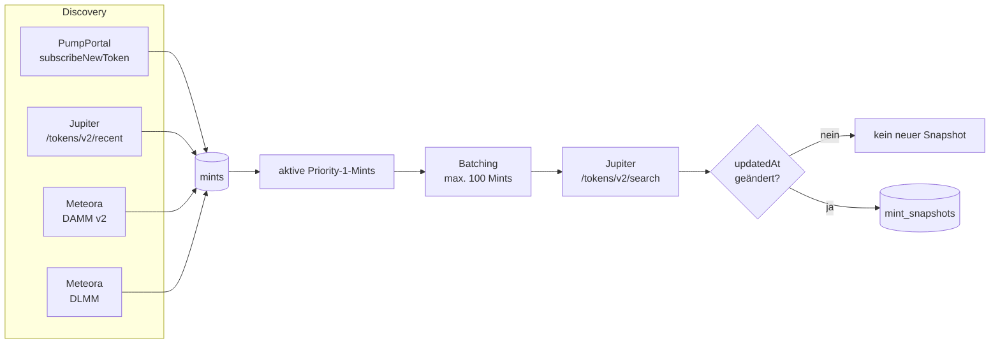

# jupiter-data-transform

Automatische Discovery von Solana-Mints und regelmäßige Erfassung ihrer Jupiter-Tokens-V2-Zustände in PostgreSQL.

## Datenfluss



Discovery-Quellen liefern ausschließlich Mint-Adressen. Die eigentlichen Tokeninformationen kommen anschließend von Jupiter Search.

## Struktur

```text
jupiter-data-transform/
├── src/
│   ├── main.py
│   ├── config.py
│   ├── discovery.py
│   ├── refresh.py
│   ├── repository.py
│   ├── sampling_rate.py
│   └── schema.sql
├── docs/
│   └── architecture.md
├── AGENTS.md
├── README.md
├── requirements.txt
├── pyproject.toml
├── .env.example
└── .gitignore
```

Die Python-Struktur bleibt bewusst flach. Neue Unterordner werden nur eingeführt, wenn eine tatsächliche fachliche Grenze sie rechtfertigt.

## Voraussetzungen

- Python 3.14
- PostgreSQL
- Jupiter API Keys
- PumpPortal API Key

## Installation

```powershell
py -3.14 -m venv .venv
.\.venv\Scripts\Activate.ps1
python -m pip install --upgrade pip
python -m pip install -r requirements.txt
Copy-Item .env.example .env
```

Danach die lokalen Zugangsdaten in `.env` eintragen. `.env` wird nicht committed.

## Start

```powershell
python src/main.py init-schema
python src/main.py run
```

## Komponenten

| Komponente | Aufgabe |
|---|---|
| PumpPortal | neue Token-Mints per WebSocket entdecken |
| Jupiter Recent | neue Mints über `/tokens/v2/recent` entdecken |
| Meteora DAMM v2 | Mints aus aktuellen Pools entdecken |
| Meteora DLMM | Mints aus DLMM-Pools entdecken |
| Jupiter Search | bekannte aktive Mints in Batches aktualisieren |
| Repository | Mints und veränderte Jupiter-Zustände persistieren |

## Persistenz

### `mints`

Zentrale Registry der bekannten Mint-Adressen. Neue Discovery-Ergebnisse werden aktuell mit `priority = 1` und `tracking_enabled = true` aufgenommen.

### `mint_snapshots`

Speichert einen vollständigen Jupiter-Payload nur dann neu, wenn sich `updatedAt` gegenüber dem zuletzt bekannten Zustand des Mints verändert hat.

`observed_at` hält den lokalen Empfangszeitpunkt fest.

## Aktuelle Grenze

Noch nicht Bestandteil des Systems sind:

- Lifecycle-Regeln zur Priorisierung oder Deaktivierung;
- Timeframes / OHLC;
- TimescaleDB;
- automatische Datenverdichtung;
- weitergehende Normalisierung;
- Unit-Tests.

Die technische Architektur ist in [`docs/architecture.md`](docs/architecture.md) beschrieben.

Regeln für zukünftige Änderungen stehen in [`AGENTS.md`](AGENTS.md).
