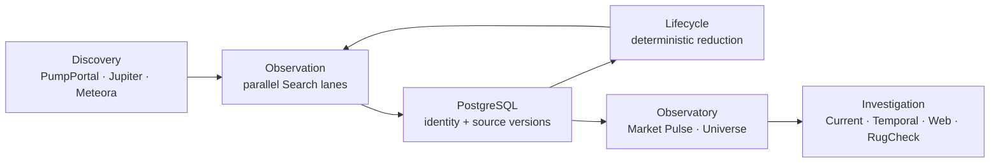

# Solana Token Observatory

[](https://github.com/0bLad20x/solana-token-observatory/actions/workflows/verify.yml)

**A live, self-curating research environment for emerging Solana tokens.**

<!-- TODO: replace the static hero with a short Observatory product demo once captured. -->

<p align="center">
  
</p>

New Solana tokens appear continuously. Keeping every discovered mint under permanent observation does not scale.

The Observatory discovers candidates across multiple live sources, observes their changing state, preserves meaningful source versions, and uses deterministic lifecycle rules to retire weak observation targets.

The surviving population becomes explorable: Market Pulse shows the system at population level, the Token Universe turns active launchpads and tokens into a live spatial environment, and selecting a token leads directly into current, temporal, web, and RugCheck evidence.

> The project is an observation and research system. It does not execute trades or make investment decisions.

## From discovery to investigation

```text
DISCOVER
PumpPortal · Jupiter · Meteora
        ↓
OBSERVE
parallel rate-limit-aware Jupiter Search lanes
        ↓
REMEMBER CHANGE
persist new upstream source versions
        ↓
SELF-CURATE
deterministic lifecycle rules
        ↓
EXPLORE
Market Pulse · Token Universe
        ↓
INVESTIGATE
Current · Temporal · Web · RugCheck
```

The core problem is not finding another mint. It is maintaining a useful working population while large volumes of external observations continue to arrive.

## Observation at scale

<!-- TODO: replace TBD values with one clearly dated measured runtime window. -->

> Runtime numbers below are pending measurement. They will describe one explicit observation window rather than static project guarantees.

| Measured runtime window | Observed |
|---|---:|
| Search lanes observed | **TBD** |
| New mints discovered | **TBD** |
| Successful Search requests | **TBD** |
| Mint positions requested | **TBD** |
| Mint observations received | **TBD** |
| New source snapshots persisted | **TBD** |
| Observations without a new persisted snapshot | **TBD** |
| Tokens retired by lifecycle | **TBD** |
| Active population at end of window | **TBD** |

Jupiter Search runs more frequently than upstream token state changes. That is intentional: the collector has to ask the source to learn whether anything changed. When a response carries a Jupiter `updatedAt` that is already known, observation state advances but persistence does not create another historical snapshot.

The measured relationship between received observations and newly persisted source versions will show how much live query volume represents unchanged or already-known upstream state.

## Explore the population

### Market Pulse

<!-- TODO: add a current Market Pulse screenshot or short capture. -->

Market Pulse provides the macro view of the observed population: activity, liquidity, breadth, concentration, and buy/sell behavior.

It answers:

> **What is the population doing right now?**

### Token Universe

<p align="center">
  
</p>

The Token Universe is the mesoscopic view. Active tokens inhabit launchpad-centered clusters in a custom browser physics simulation. Market state affects bubble size, token age influences radial position, and lifecycle transitions change the visible population itself.

It answers:

> **What exists, where did it come from, and what catches my attention?**

### Investigate a token

<p align="center">
  
</p>

Selecting a token synchronizes the Observatory around the same mint.

| Scope | Evidence |
|---|---|
| **Current** | projected current token state |
| **Temporal** | deterministic summary of retained observations |
| **Web** | external research bound to the exact mint |
| **RugCheck** | projected RugCheck evidence |

AI interprets bounded evidence. **Deterministic lifecycle rules alone control hard retirement.**

## The system curates itself

Discovery is intentionally broad. Continuous observation is expensive.

Seven deterministic lifecycle rules evaluate historical evidence and remove observation targets that no longer justify continued polling.

```text
new candidate
     ↓
observation
     ↓
temporal evidence accumulates
     ↓
┌──────────────────────┐
│ lifecycle evaluation │
└──────────┬───────────┘
           │
      ┌────┴────┐
      ↓         ↓
   survive    retire
      ↓          ↓
continue      stop consuming
observation   observation capacity
```

This creates a bounded working population instead of an ever-growing list of everything ever discovered.

The exact lifecycle semantics live in [`docs/LIFECYCLE_CONTRACT.md`](docs/LIFECYCLE_CONTRACT.md).

## What happens underneath

### Parallel observation

Multiple Jupiter API keys operate as independent, phase-shifted observation lanes over a shared active population. Adding observation capacity does not require duplicating lifecycle or persistence logic.

### Change-aware history

The collector distinguishes **seeing a token again** from **seeing a new source version**. Only newer Jupiter source versions become historical snapshots.

### Deterministic temporal context

The Analyst does not receive an unrestricted dump of historical records. Core trajectory data is retained exactly while heavier rolling payloads are sampled into bounded temporal context before model interpretation.

### Evidence stays separate from interpretation

Raw/native evidence, deterministic projections, and AI interpretation remain distinct. `missing`, `unknown`, and numeric zero are not interchangeable.

## See the machine working

<p align="center">
  
</p>

Operational Flow visualizes live Discovery, Search, persistence, and Lifecycle activity through a best-effort telemetry side channel.

The visualization is explanatory, not authoritative: durable domain state remains in PostgreSQL.

## Architecture



The important boundary is simple:

```text
external sources
      ↓
observation
      ↓
durable evidence
      ↓
deterministic reduction
      ↓
human / AI investigation
```

The Observatory reads the resulting state; it does not own the underlying domain truth.

## Where this can grow

The current architecture is centered on tokens and their observed external state. A natural next direction is richer evidence rather than simply more features.

```text
Token
 ├── Jupiter market evidence
 ├── RugCheck evidence
 ├── Web evidence
 └── possible future on-chain / pool evidence
          └── Meteora DLMM state
```

Pool association, DLMM liquidity structure, and RPC/IDL-decoded on-chain state could make it possible to study how token behavior relates to the market structure underneath it.

These are **possible extensions of the existing research model, not current capabilities**.

## Run locally

### Requirements

- **Python 3.14**
- **PostgreSQL** — [Download](https://www.postgresql.org/download/)
- **Jupiter API key(s)** — [Jupiter Developer Portal](https://developers.jup.ag/portal)
- **PumpPortal API key** — required for the corresponding discovery source
- **Mistral API key** — [Mistral Console](https://console.mistral.ai/) for Analyst features
- **Node.js 24** — only needed for frontend contract tests

### Install

```powershell
py -3.14 -m venv .venv
.\.venv\Scripts\Activate.ps1
python -m pip install --upgrade pip
python -m pip install -r requirements.txt
Copy-Item .env.example .env
```

Add local credentials to `.env`. The file is ignored by Git and must not be committed.

Initialize the schema:

```powershell
python src/main.py init-schema
```

Run the three operational paths:

```powershell
python src/main.py run
python src/lifecycle_clean.py --apply
python src/frontend.py
```

The Observatory is available by default at `http://127.0.0.1:8000`.

### Measure a runtime window

The normal Observatory telemetry stays on port `8765`. An optional local mirror on `8766` lets a separate recorder aggregate the same event stream without changing PostgreSQL or the operational runtime.

Ensure these values exist in `.env` before starting Collector and Lifecycle:

```text
TELEMETRY_MIRROR_HOST=127.0.0.1
TELEMETRY_MIRROR_PORT=8766
```

Collector and Lifecycle read this configuration when their processes start. After adding or changing the mirror settings, **restart both processes** before starting a measurement window.

Start the recorder first:

```powershell
python src/measurement_recorder.py --hours 1 --output measurements/runtime-1h.json
```

Then run Collector and Lifecycle normally in separate terminals. The Observatory can run at the same time because it continues to receive the primary telemetry stream on port `8765`.

For a 24-hour measurement:

```powershell
python src/measurement_recorder.py --hours 24 --output measurements/runtime-24h.json
```

The recorder writes periodic atomic checkpoints, so the current aggregate remains inspectable while the window is running. `measurements/` is ignored by Git.

The output is explicitly a **best-effort local telemetry aggregate**, not domain truth. Local UDP loss can undercount events; durable token and lifecycle state remains in PostgreSQL.

## Verification

Core deterministic verification:

```powershell
python -m compileall -q src tools
python -m unittest discover -s tests -v
python src/main.py --help
python src/lifecycle_clean.py --help
python src/measurement_recorder.py --help
```

Frontend contracts:

```powershell
$tests = Get-ChildItem tests\*.mjs | ForEach-Object { $_.FullName }
node --test $tests
```

GitHub Actions runs the deterministic suite on pushes and pull requests to `main`.

Database-backed lifecycle equivalence and live external-provider behavior remain separate from deterministic CI.

## Deep dives

- [`docs/architecture.md`](docs/architecture.md) — architecture, ownership, and data flow
- [`docs/LIFECYCLE_CONTRACT.md`](docs/LIFECYCLE_CONTRACT.md) — exact lifecycle semantics
- [`docs/FRONTEND_OBSERVATORY.md`](docs/FRONTEND_OBSERVATORY.md) — Observatory, live state, telemetry, and Analyst contracts
- [`AGENTS.md`](AGENTS.md) — repository development rules
