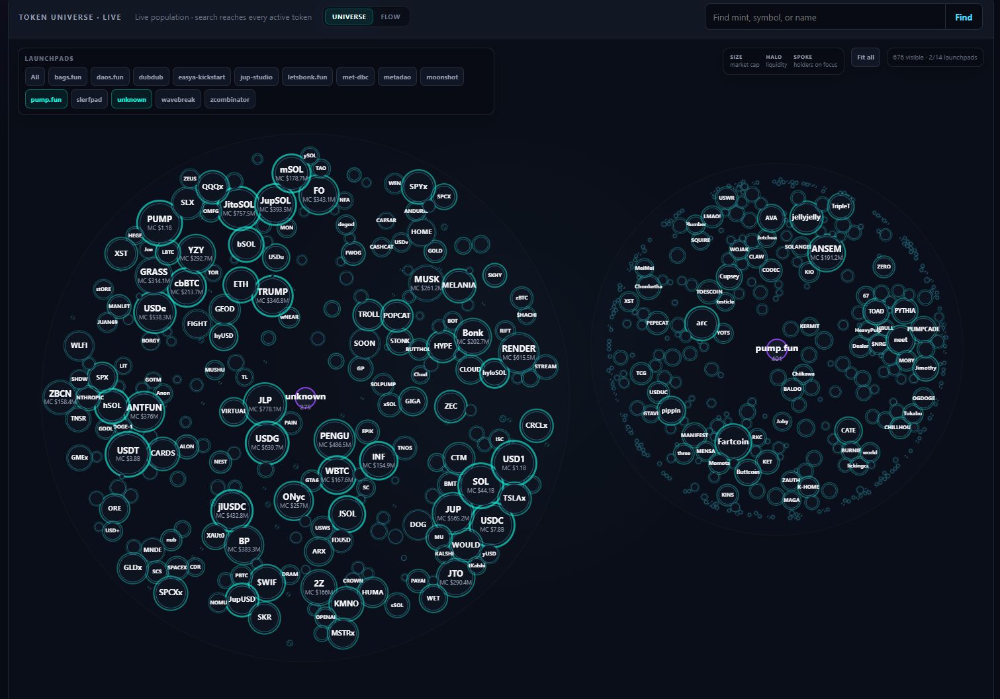
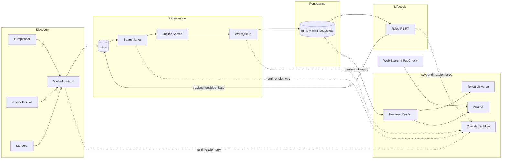
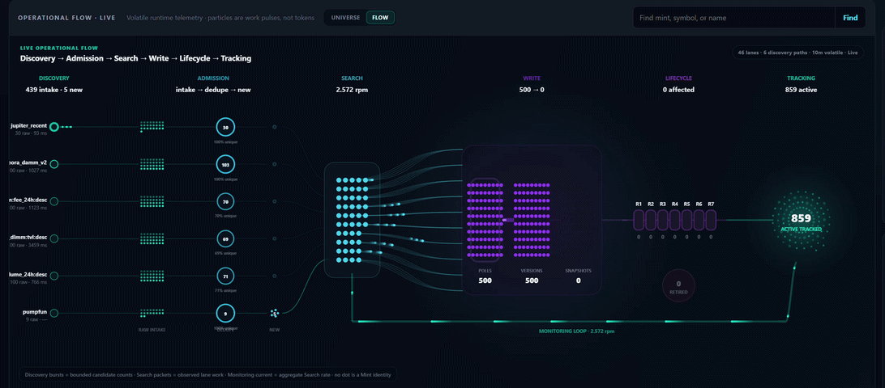
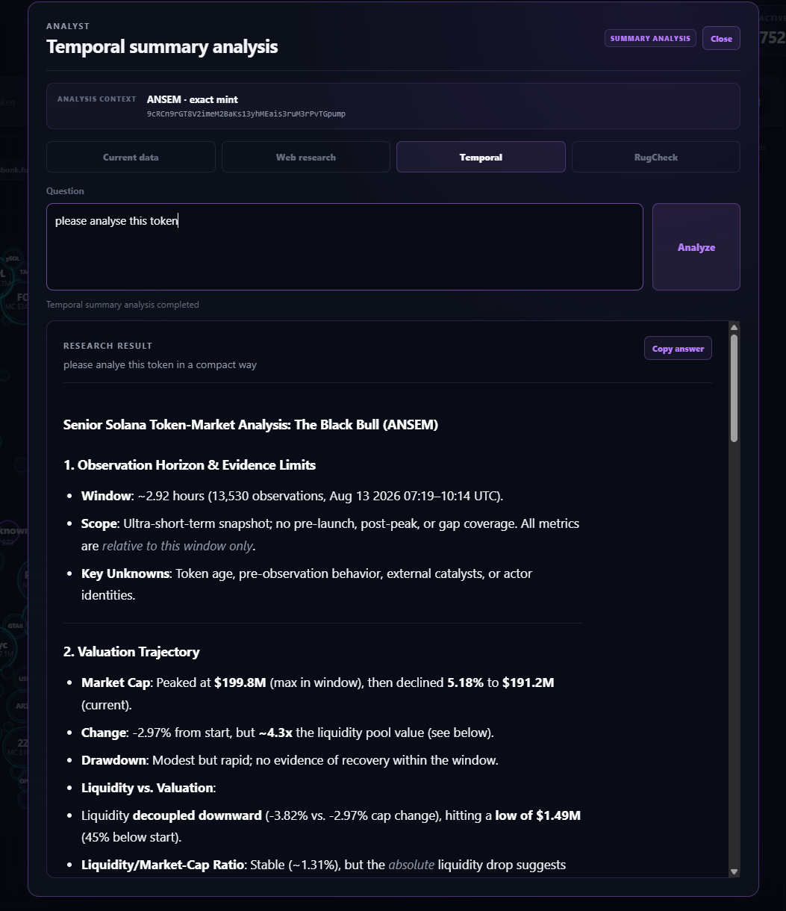

# Solana Token Observatory

[](https://github.com/0bLad20x/solana-token-observatory/actions/workflows/verify.yml)

**An end-to-end real-time monitoring and AI-assisted analysis system for newly emerging Solana tokens.**

It discovers tokens from multiple live sources, continuously observes their state, persists meaningful source changes, applies explicit lifecycle rules to reduce the monitored population, and exposes the resulting state through an interactive read-only observatory with bounded LLM-assisted analysis.

<p align="center">
  
</p>

## Why this project exists

New Solana tokens appear faster than they can be monitored meaningfully forever. Keeping every discovered token active indefinitely wastes API capacity, stores large amounts of low-value data, and makes current-state analysis harder.

This project therefore focuses on a narrower operational question:

> **Which tokens are still relevant enough to keep observing, and how can their current state be investigated transparently?**

The system combines continuous observation, deterministic lifecycle automation, a read-only operational interface, and bounded LLM-assisted investigation. It is an observation and analysis system, not a trading stack or a complete historical market index.

## What it does

- **Discovers** new mint addresses from PumpPortal, Jupiter Recent, and Meteora.
- **Observes** active mints continuously through Jupiter Tokens V2 Search.
- **Persists** meaningful source-state changes instead of redundant poll copies.
- **Applies lifecycle rules** that reduce the active population through explicit, versioned criteria.
- **Projects current state** into an interactive Token Universe and operational flow view.
- **Exposes runtime telemetry** for Discovery, Search, WriteQueue, Lifecycle, and Tracking activity.
- **Adds LLM-assisted investigation** for current data, temporal summaries, web evidence, and RugCheck evidence.

## What I built

I designed and implemented the system end-to-end, including:

- multi-source token discovery;
- continuous API observation;
- PostgreSQL persistence and snapshot semantics;
- deterministic lifecycle automation;
- backend and read-only data access;
- interactive frontend state and visualization;
- runtime telemetry;
- LLM tool calling and web-assisted research;
- bounded temporal and RugCheck analysis;
- backend and frontend tests;
- architecture, lifecycle, and frontend contracts.

## AI-assisted development

AI coding tools were used during implementation, analysis, and iteration.

Project-level responsibilities remained explicit, including:

- defining requirements and system boundaries;
- making architecture decisions;
- decomposing implementation work;
- defining acceptance criteria;
- reviewing generated implementations;
- testing and validation;
- rejecting or revising unsuitable approaches;
- maintaining architectural consistency across iterations.

## Project status

The current repository contains working paths for:

- [x] Multi-source discovery
- [x] Continuous Jupiter observation
- [x] PostgreSQL persistence
- [x] Version-aware snapshot retention
- [x] Deterministic lifecycle processing
- [x] Interactive observatory
- [x] Runtime telemetry
- [x] LLM-assisted current-data analysis
- [x] External web research
- [x] Temporal analysis
- [x] RugCheck evidence analysis
- [x] Backend tests
- [x] Frontend contract tests

## System overview



### A poll is not a snapshot

The collector is an **observation system**, not a conventional database synchronizer. Before a request, the system does not know whether Jupiter has published a new source version. Repeated HTTP observations are therefore intentional.

```text
successful poll
    ├── same Jupiter updatedAt  -> last_polled_at advances
    │                            no redundant snapshot
    └── new Jupiter updatedAt   -> persist snapshot
                                 last_changed_at advances
```

This distinction is central to the design: network observation may be redundant, while persisted source versions should not be.

## Token Universe

The Token Universe is a spatial projection of the currently active population. It does not own domain truth: position, size, color, and motion are presentation concerns, while mint identity, market values, timestamps, and tracking state come from the canonical read-only projection.

The browser maintains exactly one active population and one shared `selectedMint`. Search, Inspector, Universe, and Analyst operate on that shared state.

## Live dataflow

<p align="center">
  
</p>

The Operational Flow visualizes executed work across Discovery, Admission, Search, WriteQueue, Lifecycle, and Tracking using ephemeral runtime telemetry. This telemetry is intentionally best-effort and RAM-based; it does not own operational truth.

## Analyst

<p align="center">
  
</p>

The Analyst is a bounded, read-only consumer with four separate use cases:

| Scope | Responsibility |
|---|---|
| `current_data` | inspect the current active population through a bounded query tool |
| `web` | collect external web evidence bound to the exact mint address |
| `temporal` | interpret a deterministic `<=24h` temporal summary |
| `rugcheck` | analyze RugCheck evidence separately from projection and LLM interpretation |

LLM responses are interpretation, not system truth, and never act as an operational lifecycle trigger.

## Data model

| Structure | Responsibility |
|---|---|
| `mints` | mint identity, collector timestamps, tracking state, and disable state |
| `mint_snapshots` | immutable Jupiter source versions actually observed within the 24h raw buffer |
| `lifecycle_rule_state` | monotonic scan cursors for lifecycle rules processing historical snapshot evidence |

Important time concepts:

- `first_observed_at` — first persisted Jupiter source version;
- `last_polled_at` — latest successful Jupiter Search poll;
- `last_changed_at` — local observation time of the most recent new source version;
- `source_updated_at` — latest persisted Jupiter `updatedAt` value.

`missing` or `unknown` is never silently interpreted as numeric zero.

## Runtime

The system intentionally has three separate runtime paths:

```text
Collector        python src/main.py run
Lifecycle        python src/lifecycle_clean.py --apply
Observatory      python src/frontend.py
```

The Collector owns Discovery, Jupiter Observation, Persistence, and 24h snapshot retention. Lifecycle is the only domain-level hard-retire path. The Observatory remains read-only.

## Requirements

- **Python 3.14**
- **PostgreSQL** — [Download](https://www.postgresql.org/download/)
- **Jupiter API key(s)** — [Jupiter Developer Portal](https://developers.jup.ag/portal)
  - required for `JUPITER_SEARCH_API_KEYS`
  - optional separate key for `JUPITER_RECENT_API_KEY`
- **PumpPortal API key** — required for the corresponding discovery source
- **Mistral API key** — [Mistral Console](https://console.mistral.ai/)
  - create it under **API Keys**
  - required for `MISTRAL_API_KEY`

## Installation

```powershell
py -3.14 -m venv .venv
.\.venv\Scripts\Activate.ps1
python -m pip install --upgrade pip
python -m pip install -r requirements.txt
Copy-Item .env.example .env
```

Add local credentials to `.env`. The file is ignored by Git and must not be committed.

## Run the system

Initialize the schema:

```powershell
python src/main.py init-schema
```

Start the Collector:

```powershell
python src/main.py run
```

Inspect Lifecycle once in dry-run mode:

```powershell
python src/lifecycle_clean.py --once
```

Start Lifecycle in operational mode:

```powershell
python src/lifecycle_clean.py --apply
```

Start the Observatory:

```powershell
python src/frontend.py
```

By default, the Observatory is available at `http://127.0.0.1:8000`.

## Verification

The repository has an automated GitHub Actions verification workflow. Every pull request and every push to `main` executes deterministic software gates on a clean runner.

### Automated Python verification

```powershell
python -m compileall -q src tools
python -m unittest discover -s tests -v
python src/main.py --help
python src/lifecycle_clean.py --help
```

### Automated frontend contracts

```powershell
$tests = Get-ChildItem tests\*.mjs | ForEach-Object { $_.FullName }
node --test $tests
```

On Unix-like systems, the same frontend suite can be run with:

```bash
node --test tests/*.mjs
```

The automated workflow verifies source compilation, Python tests, CLI entry points, and frontend contract tests.

### Database-backed lifecycle equivalence check

The lifecycle equivalence verifier is intentionally separate from CI because it reads a configured PostgreSQL database under a repeatable-read transaction. With a valid local `.env` and database state, run:

```powershell
python tools/verify_lifecycle_contract_v01.py
```

Live provider calls, real credentials, database-backed equivalence checks, and an operational PostgreSQL runtime are therefore not presented as deterministic CI evidence. They remain explicit runtime/integration concerns.

## Documentation

Each durable document owns one class of technical questions:

- [`docs/architecture.md`](docs/architecture.md) — technical architecture, data flow, and ownership;
- [`docs/LIFECYCLE_CONTRACT.md`](docs/LIFECYCLE_CONTRACT.md) — exact Rule 1–7 lifecycle semantics;
- [`docs/FRONTEND_OBSERVATORY.md`](docs/FRONTEND_OBSERVATORY.md) — Observatory, synchronization, telemetry, and Analyst contracts;
- [`AGENTS.md`](AGENTS.md) — repository rules for changes and agent-assisted development.

README media assets live under [`docs/assets/`](docs/assets/). Open work is tracked in GitHub Issues; implementation history belongs in Git.
