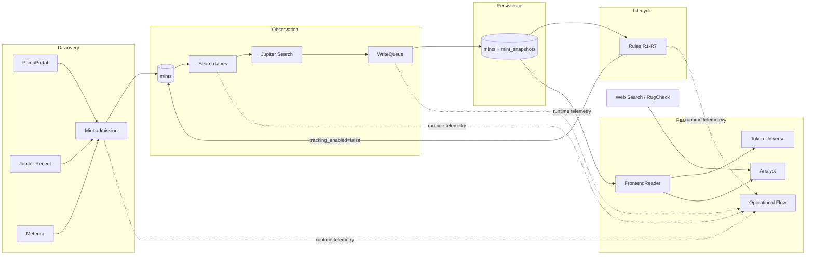

# Solana Token Observatory

[](https://github.com/0bLad20x/solana-token-observatory/actions/workflows/verify.yml)

**Discover → observe → filter → investigate emerging Solana tokens in real time.**

New Solana tokens appear faster than any monitor can follow forever. This project turns that stream into a smaller, explainable working set: it discovers mints from multiple live sources, records meaningful source-version changes, retires weak tracking targets with deterministic lifecycle rules, and exposes the survivors through an interactive Observatory with bounded AI-assisted research.

<p align="center">
  
</p>

<p align="center"><em>Token Universe — an explorable projection of the currently active token population.</em></p>

> The project is an observation and research system. It does not execute trades, make investment decisions, or use LLM output as an operational lifecycle trigger.

## Why this exists

**Discovery is easy. Continuous observation is the hard part.**

A new mint can appear in seconds, but many newly discovered tokens quickly become inactive, stagnant, or otherwise low-value to keep polling. If every discovered mint stays active forever, API capacity is spent on noise, storage fills with redundant observations, and useful current-state analysis becomes harder.

The project therefore asks a narrower engineering question:

> **Which tokens are still worth observing, and how can their current state be investigated without losing the evidence behind that decision?**

That leads to a deliberately split design:

- continuous discovery finds new candidates;
- observation records what external sources actually publish;
- deterministic lifecycle rules decide what remains actively tracked;
- the Observatory presents current state without owning domain truth;
- LLM-assisted tools interpret evidence but do not control lifecycle decisions.

## What you can explore

| Area | What it lets you inspect |
|---|---|
| **Token Universe** | the currently active population as an interactive spatial view |
| **Operational Flow** | live Discovery, Search, WriteQueue, Lifecycle, and Tracking activity |
| **Inspector / Search** | the selected token and its current projected state |
| **Analyst** | bounded current-data queries, temporal summaries, exact-mint web research, and RugCheck evidence |

The system is interesting less as a "token picker" than as a **high-churn observation pipeline**: entities arrive continuously, external state changes asynchronously, storage should preserve meaningful source versions rather than every poll, and the active population has to stay bounded enough to remain useful.

## From discovery to investigation

```text
PumpPortal / Jupiter Recent / Meteora
                ↓
          mint admission
                ↓
       continuous Jupiter Search
                ↓
    version-aware PostgreSQL storage
                ↓
      deterministic lifecycle rules
                ↓
       read-only Observatory
                ↓
 current / temporal / web / RugCheck analysis
```

A token can enter through discovery, gain observed source state, accumulate meaningful source-version evidence, remain active or be retired by explicit rules, and be investigated through the same read-only projection used by the UI.

## What makes the design interesting

### A poll is not a snapshot

The collector is an **observation system**, not a conventional database synchronizer. Before a request, the system does not know whether Jupiter has published a new source version. Repeated HTTP observations are therefore intentional; redundant persisted copies are not.

```text
successful poll
    ├── same Jupiter updatedAt  -> last_polled_at advances
    │                            no redundant snapshot
    └── new Jupiter updatedAt   -> persist snapshot
                                 last_changed_at advances
```

This keeps network observation semantics separate from persisted source-version history.

### Lifecycle decisions stay deterministic

Lifecycle rules operate on explicit data and rule semantics. LLM output is interpretation only. This prevents an analysis response from silently becoming system authority.

### Presentation does not own truth

The Token Universe, Inspector, search state, and Analyst all consume a read-only projection. Bubble position, motion, sizing, and other UI concerns are presentation; canonical identity, timestamps, tracking state, and market values come from the underlying projection.

### Telemetry is intentionally ephemeral

The Operational Flow uses best-effort RAM telemetry to show what the runtime is doing now. Telemetry helps explain execution, but it is not treated as durable operational truth.

## System overview



## Inside the Observatory

### Token Universe

The Token Universe is a spatial projection of the active population. The browser maintains one shared `selectedMint`, so Search, Inspector, Universe, and Analyst remain synchronized around the same selected token.

The hero image above shows this active working set rather than a historical market index.

### Operational Flow

<p align="center">
  
</p>

<p align="center"><em>Runtime telemetry makes the data path visible while Discovery, Search, persistence, and Lifecycle work concurrently.</em></p>

The flow is intentionally explanatory rather than authoritative: its events are ephemeral, while durable system state remains in PostgreSQL.

### Analyst

<p align="center">
  
</p>

<p align="center"><em>The Analyst works against bounded evidence scopes instead of receiving unrestricted access to operational state.</em></p>

| Scope | Responsibility |
|---|---|
| `current_data` | inspect the current active population through a bounded query tool |
| `web` | collect external web evidence bound to the exact mint address |
| `temporal` | interpret a deterministic `<=24h` temporal summary |
| `rugcheck` | analyze RugCheck evidence separately from projection and LLM interpretation |

## Data model and time semantics

| Structure | Responsibility |
|---|---|
| `mints` | mint identity, collector timestamps, tracking state, and disable state |
| `mint_snapshots` | immutable Jupiter source versions actually observed within the 24h raw buffer |
| `lifecycle_rule_state` | monotonic scan cursors for lifecycle rules processing historical snapshot evidence |

Important time concepts:

- `first_observed_at` — first persisted Jupiter source version;
- `last_polled_at` — latest successful Jupiter Search poll;
- `last_changed_at` — local observation time of the most recent new source version;
- `source_updated_at` — latest persisted Jupiter `updatedAt` value.

`missing` or `unknown` is never silently interpreted as numeric zero.

## What this architecture can enable

The current project already establishes a reusable pattern:

```text
high-volume discovery
→ version-aware observation
→ deterministic population reduction
→ read-only investigation
```

That foundation could support additional evidence sources, alerting, cohort comparisons, survivor-focused metadata, or other bounded research views without requiring the LLM layer to become operational authority.

The same pattern is also broader than tokens: it applies to systems where entities arrive continuously, upstream state changes asynchronously, and only a changing subset deserves continued observation.

These are **natural extensions of the current architecture, not implemented features**.

## What I built

I designed and implemented the system end-to-end, including:

- multi-source token discovery;
- continuous API observation;
- PostgreSQL persistence and source-version snapshot semantics;
- deterministic lifecycle automation;
- backend and read-only data access;
- interactive frontend state and visualization;
- runtime telemetry;
- LLM tool calling and web-assisted research;
- bounded temporal and RugCheck analysis;
- backend and frontend tests;
- architecture, lifecycle, and frontend contracts.

## Current scope

The current repository contains working paths for:

- [x] Multi-source discovery
- [x] Continuous Jupiter observation
- [x] PostgreSQL persistence
- [x] Version-aware snapshot retention
- [x] Deterministic lifecycle processing
- [x] Interactive Observatory
- [x] Runtime telemetry
- [x] LLM-assisted current-data analysis
- [x] External web research
- [x] Temporal analysis
- [x] RugCheck evidence analysis
- [x] Backend tests
- [x] Frontend contract tests

It is intentionally **not** a trading engine, automated execution system, investment-advice product, or complete historical market index.

## Runtime

The system has three separate runtime paths:

```text
Collector        python src/main.py run
Lifecycle        python src/lifecycle_clean.py --apply
Observatory      python src/frontend.py
```

The Collector owns Discovery, Jupiter Observation, Persistence, and 24h snapshot retention. Lifecycle is the only domain-level hard-retire path. The Observatory remains read-only.

## Requirements

- **Python 3.14**
- **PostgreSQL** — [Download](https://www.postgresql.org/download/)
- **Jupiter API key(s)** — [Jupiter Developer Portal](https://developers.jup.ag/portal)
  - `JUPITER_SEARCH_API_KEYS` for Search observation;
  - `JUPITER_RECENT_API_KEY` for Jupiter Recent discovery;
- **PumpPortal API key** — required for the corresponding discovery source;
- **Mistral API key** — [Mistral Console](https://console.mistral.ai/)
  - required for Analyst LLM features;
- **Node.js 24** — only needed to run the frontend contract tests locally.

## Installation

```powershell
py -3.14 -m venv .venv
.\.venv\Scripts\Activate.ps1
python -m pip install --upgrade pip
python -m pip install -r requirements.txt
Copy-Item .env.example .env
```

Add local credentials to `.env`. The file is ignored by Git and must not be committed. Multiple `JUPITER_SEARCH_API_KEYS` are represented as a comma-separated value, matching `.env.example`.

## Run the system

Initialize the schema:

```powershell
python src/main.py init-schema
```

Start the Collector:

```powershell
python src/main.py run
```

Inspect Lifecycle once in dry-run mode:

```powershell
python src/lifecycle_clean.py --once
```

Start Lifecycle in operational mode:

```powershell
python src/lifecycle_clean.py --apply
```

Start the Observatory:

```powershell
python src/frontend.py
```

By default, the Observatory is available at `http://127.0.0.1:8000`.

## Quality and verification

The GitHub Actions **CI** workflow runs deterministic repository checks on every pull request to `main` and every push to `main`.

### Python checks

```powershell
python -m compileall -q src tools
python -m unittest discover -s tests -v
python src/main.py --help
python src/lifecycle_clean.py --help
```

### Frontend contracts

```powershell
$tests = Get-ChildItem tests\*.mjs | ForEach-Object { $_.FullName }
node --test $tests
```

On Unix-like systems:

```bash
node --test tests/*.mjs
```

Core CI proves that the repository installs on a clean runner, source compilation succeeds, the Python test suite passes, CLI entry points load, and frontend contracts pass.

### Database-backed lifecycle equivalence

The lifecycle equivalence verifier is intentionally separate from core CI because it reads a configured PostgreSQL database under a repeatable-read transaction:

```powershell
python tools/verify_lifecycle_contract_v01.py
```

Live provider availability, real credentials, database-backed equivalence, and an operational PostgreSQL runtime are therefore not presented as deterministic CI evidence.

## AI-assisted development

AI coding tools were used during implementation, analysis, and iteration.

Project-level responsibilities remained explicit, including:

- defining requirements and system boundaries;
- making architecture decisions;
- decomposing implementation work;
- defining acceptance criteria;
- reviewing generated implementations;
- testing and validation;
- rejecting or revising unsuitable approaches;
- maintaining architectural consistency across iterations.

## Documentation

Each durable document owns one class of technical questions:

- [`docs/architecture.md`](docs/architecture.md) — technical architecture, data flow, and ownership;
- [`docs/LIFECYCLE_CONTRACT.md`](docs/LIFECYCLE_CONTRACT.md) — exact Rule 1–7 lifecycle semantics;
- [`docs/FRONTEND_OBSERVATORY.md`](docs/FRONTEND_OBSERVATORY.md) — Observatory, synchronization, telemetry, and Analyst contracts;
- [`AGENTS.md`](AGENTS.md) — repository rules for changes and agent-assisted development.

README media assets and capture guidance live under [`docs/assets/`](docs/assets/). Open work is tracked in GitHub Issues; implementation history belongs in Git.
