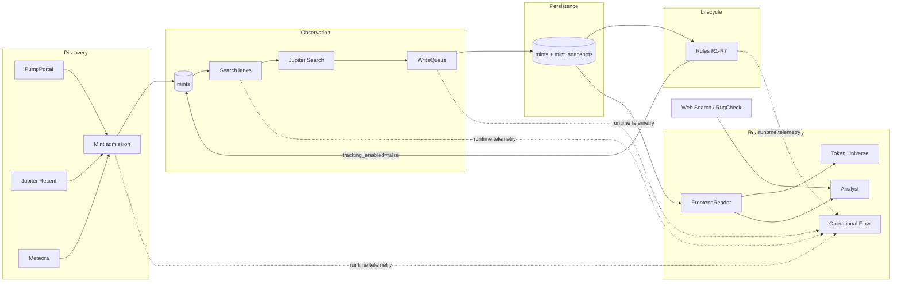

# Solana Token Observatory

**Ein Echtzeit-Beobachtungssystem für neu entstehende Solana-Tokens – von Discovery und hochfrequenter Jupiter-Beobachtung über explizite Lifecycle-Regeln bis zu einem read-only Observatory mit Live-Telemetry und LLM-gestützter Analyse.**

<p align="center">
  
</p>

## Vision

Neue Solana-Tokens entstehen schneller, als sie sinnvoll dauerhaft überwacht werden können. `jupiter-data-transform` baut deshalb keinen vollständigen historischen Index und keinen Trading-Stack. Das System beantwortet eine engere Frage:

> **Welche Tokens sind gerade relevant genug, um weiter beobachtet zu werden – und wie lässt sich dieser laufende Zustand nachvollziehbar untersuchen?**

Dafür verbindet das Projekt vier operative Verantwortungen mit einer strikt read-only Analyseebene:

- **Discovery** nimmt neue Mint-Adressen aus PumpPortal, Jupiter Recent und Meteora auf.
- **Observation** sampelt aktive Mints hochfrequent über Jupiter Tokens V2 Search.
- **Persistence** bewahrt tatsächlich beobachtete Source-Versionen statt redundanter Poll-Kopien.
- **Lifecycle** reduziert die aktive Population über explizite, versionierte Regeln.
- **Observatory** projiziert den laufenden Zustand als Token Universe und Operational Flow.
- **Analyst** ergänzt bounded LLM-Workflows für aktuelle Daten, zeitliche Entwicklung und externe Evidence.

## Systemüberblick



### Ein Poll ist kein Snapshot

Der Collector ist ein **Beobachtungssystem**, kein klassischer Datenbank-Synchronizer. Vor einem Request ist unbekannt, ob Jupiter inzwischen eine neue Source-Version besitzt. Deshalb sind wiederholte HTTP-Beobachtungen beabsichtigt.

```text
successful poll
    ├── same Jupiter updatedAt  -> last_polled_at advances
    │                            no redundant snapshot
    └── new Jupiter updatedAt   -> persist snapshot
                                 last_changed_at advances
```

Diese Trennung ist zentral: Netzwerkbeobachtung darf redundant sein; persistierte Source-Versionen sollen es nicht sein.

## Token Universe

Das Token Universe ist die räumliche Projektion der aktuell aktiven Population. Es besitzt keine eigene Domain-Truth: Position, Größe, Farbe und Motion sind Presentation; Mint, Marktwerte, Timestamps und Tracking-State stammen aus der kanonischen read-only Projektion.

Der Browser hält genau **eine aktive Population** und genau **einen gemeinsamen `selectedMint`**. Search, Inspector, Universe und Analyst arbeiten auf diesem gemeinsamen Zustand.

## Live Dataflow

<p align="center">
  
</p>

Der Operational Flow macht die ausgeführte Arbeit sichtbar: Discovery, Admission, Search, WriteQueue, Lifecycle und Tracking werden aus flüchtiger Runtime-Telemetry dargestellt. Diese Telemetry ist bewusst best-effort, RAM-basiert und besitzt keine operative Authority.

## Analyst

<p align="center">
  
</p>

Der Analyst ist ein bounded, read-only Consumer. Er besitzt vier getrennte Use Cases:

| Scope | Aufgabe |
|---|---|
| `current_data` | aktuelle aktive Population über ein begrenztes Query-Tool untersuchen |
| `web` | externe Web-Evidence, gebunden an die exakte Mint-Adresse |
| `temporal` | deterministischen `<=24h` Temporal Summary interpretieren |
| `rugcheck` | RugCheck-Evidence getrennt von Projektion und LLM-Interpretation analysieren |

LLM-Antworten sind Interpretation, keine System Truth und niemals ein operativer Lifecycle-Trigger.

## Datenmodell

| Struktur | Verantwortung |
|---|---|
| `mints` | Mint-Identität, Collector-Timestamps, Tracking- und Disable-State |
| `mint_snapshots` | immutable, tatsächlich beobachtete Jupiter-Source-Versionen im 24h-Raw-Buffer |
| `lifecycle_rule_state` | monotone Scan-Cursor für Lifecycle-Regeln, die historische Snapshot-Evidence abarbeiten |

Wichtige Zeitbegriffe:

- `first_observed_at` — erste persistierte Jupiter-Source-Version;
- `last_polled_at` — letzter erfolgreicher Jupiter-Search-Poll;
- `last_changed_at` — lokale Beobachtungszeit der jüngsten neuen Source-Version;
- `source_updated_at` — jüngster persistierter Jupiter-`updatedAt`-Wert.

`missing` oder `unknown` wird niemals stillschweigend als numerische Null interpretiert.

## Runtime

Das System besteht bewusst aus drei separaten Laufzeitpfaden:

```text
Collector        python src/main.py run
Lifecycle        python src/lifecycle_clean.py --apply
Observatory      python src/frontend.py
```

Der Collector besitzt Discovery, Jupiter Observation, Persistence und 24h Snapshot-Retention. Der Lifecycle ist der einzige fachliche Hard-Retire-Pfad. Das Observatory bleibt read-only.

## Voraussetzungen

- Python 3.14
- PostgreSQL
- Jupiter API Key(s)
- PumpPortal API Key für die entsprechende Discovery-Quelle
- Mistral API Key für Analyst-Funktionen

## Installation

```powershell
py -3.14 -m venv .venv
.\.venv\Scripts\Activate.ps1
python -m pip install --upgrade pip
python -m pip install -r requirements.txt
Copy-Item .env.example .env
```

Danach die lokalen Zugangsdaten in `.env` eintragen. `.env` wird nicht committed.

## Inbetriebnahme

Schema initialisieren:

```powershell
python src/main.py init-schema
```

Collector starten:

```powershell
python src/main.py run
```

Lifecycle zunächst einmalig als Dry-Run prüfen:

```powershell
python src/lifecycle_clean.py --once
```

Lifecycle operativ starten:

```powershell
python src/lifecycle_clean.py --apply
```

Observatory starten:

```powershell
python src/frontend.py
```

Standardmäßig ist das Observatory unter `http://127.0.0.1:8000` erreichbar.

## Validierung

Python-Core und Contracts:

```powershell
python -m compileall -q src tools
python -m unittest discover -s tests -v
python tools/verify_lifecycle_contract_v01.py
python src/main.py --help
python src/lifecycle_clean.py --help
```

Frontend-Verträge:

```powershell
$tests = Get-ChildItem tests\*.mjs | ForEach-Object { $_.FullName }
node --test $tests
```

## Dokumentation

Die dauerhafte Dokumentation besitzt genau eine Authority pro Frage:

- [`docs/architecture.md`](docs/architecture.md) — technische Architektur, Datenfluss und Ownership;
- [`docs/LIFECYCLE_CONTRACT.md`](docs/LIFECYCLE_CONTRACT.md) — exakte Rule-1–7-Lifecycle-Semantik;
- [`docs/FRONTEND_OBSERVATORY.md`](docs/FRONTEND_OBSERVATORY.md) — Observatory-, Synchronisations-, Telemetry- und Analyst-Vertrag;
- [`AGENTS.md`](AGENTS.md) — verbindliche Regeln für Repository-Änderungen.

Die drei README-Medien liegen unter [`docs/assets/`](docs/assets/). Offene Arbeit wird in GitHub Issues geführt; die Änderungshistorie gehört in Git.
