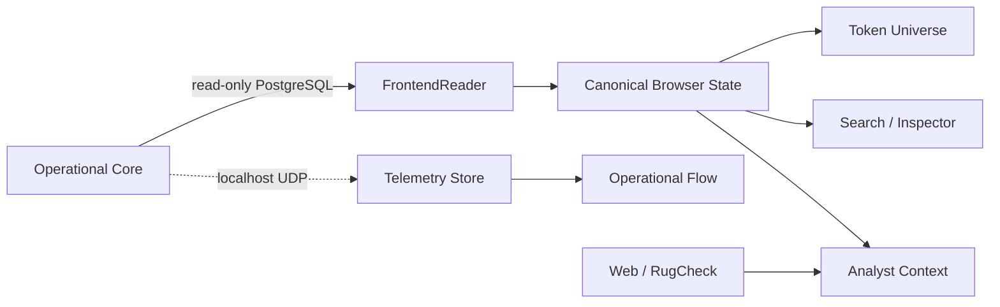
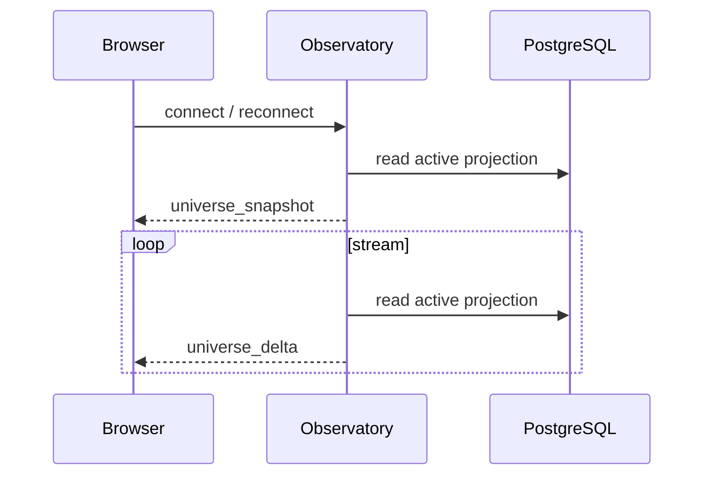
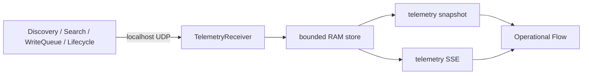

# Frontend Observatory

## Zweck und Systemgrenze

`src/observatory/` ist die read-only Beobachtungs- und Analyseebene von `solana-token-observatory`. Das Observatory stellt operative Fakten dar, erzeugt deterministische Read Models, visualisiert flüchtige Runtime-Telemetry und bietet bounded Analyst-Workflows.

Es besitzt **keine** Authority über Tracking, Priority, Collector-State oder Lifecycle-Entscheidungen.



## 1. Truth Model

Das Observatory unterscheidet fünf Ebenen. Diese Trennung ist Teil des funktionalen Vertrags.

| Ebene | Bedeutung | Operative Authority |
|---|---|---|
| **System Truth** | direkt gelesene oder deterministisch persistierte operative Fakten | nur der operative Core |
| **Deterministic Analysis** | reproduzierbare Ableitungen aus Systemdaten | keine |
| **Runtime Telemetry** | flüchtige Beobachtung tatsächlich ausgeführter Arbeit | keine |
| **External Evidence** | externe Provider-/Web-Evidence | keine |
| **LLM Interpretation** | probabilistische Interpretation der bereitgestellten Evidence | keine |

Keine Ebene darf stillschweigend in eine stärkere Truth-Klasse hochgestuft werden. Insbesondere sind LLM-Antworten keine Lifecycle-Evidence und Runtime-Telemetry ist kein persistenter Systemzustand.

## 2. Canonical Browser State

Der Browser besitzt genau:

- **eine kanonische aktive Token-Population**;
- **einen gemeinsamen `selectedMint`**.

Search, Inspector, Token Universe, Activity und selected-token Analyst-Scopes konsumieren diesen gemeinsamen Zustand. Keine View besitzt eine zweite Population oder einen eigenen Transportpfad.

```text
Universe ────────┐
Search ──────────┤
Activity ────────┼──> selectedMint
                 │        │
                 │        ├──> Inspector
                 │        ├──> Token Universe
                 │        └──> selected-token Analyst
                 │
SSE Population ──┘
```

Ein bereits selektierter Mint darf nach Retirement als lokaler Kontext sichtbar bleiben. Dadurch wird er nicht wieder Teil der aktiven Population.

Operational Flow besitzt bewusst keine Mint-Selection und keine Mint-Provenance.

## 3. Synchronisationsvertrag

`GET /api/events` ist die autoritative Browser-Synchronisationsgrenze für die aktive Population.



Jede Verbindung startet mit genau einem vollständigen `universe_snapshot`. Danach folgen ausschließlich `universe_delta`-Events.

Delta-Typen:

- `token_added`;
- `token_updated`;
- `token_retired`.

Der Snapshot ist zugleich die Server-Baseline für die nachfolgenden Deltas. Ein Reconnect resynchronisiert deshalb den Browser vollständig, bevor weitere Deltas angewendet werden.

`GET /api/token/{mint}` ist eine read-only Detail-Capability und kein zweiter Population-Updatepfad.

## 4. Functional Core und Presentation

Der Functional Core bewahrt Domain-Fakten und gemeinsame Interaktionszustände. Presentation-State bleibt in den Views.

| Functional Core | Presentation |
|---|---|
| Mint | x / y |
| Market Cap / Liquidity / Holders | Radius / Halo / Stroke |
| Launchpad | Color / Opacity |
| Timestamps | Animation progress |
| Tracking-State | Cluster geometry |
| selected Mint | Canvas transform |
| canonical token events | transient motion state |

Damit sind konkrete Packing-Algorithmen, Collision-Verhalten, Farben, Halos, Animationstiming und Layoutparameter **keine dauerhafte Domain-Semantik**. Sie dürfen iteriert werden, solange Population-, Selection- und Synchronisationsverträge erhalten bleiben.

## 5. Browser-Verantwortungen

```text
static/js/
├── app.js                  composition / wiring
├── api.js                  HTTP + SSE transport
├── state.js                population + selection + event application
├── search.js               pure search / ranking
├── activity.js             derived live signals
├── token-ui.js             Search + Inspector DOM
├── activity-ui.js          Live Deltas DOM
├── analyst-ui.js           Analyst interaction
├── markdown.js             safe Markdown subset
├── telemetry-ui.js         volatile telemetry projection
└── views/
    ├── token-universe-view.js
    └── operational-flow-view.js
```

`state.js` besitzt ausschließlich Population, `selectedMint`, Full-Snapshot Load und add/update/retire Event Application. Search, Telemetry und Presentation-State gehören nicht hinein.

## 6. Token Universe

Das Token Universe visualisiert die aktive Token-Population als räumliche Bubble-Map.

Seine Verantwortung ist:

- kanonische aktive Tokens darstellen;
- gemeinsame Selection sichtbar und interaktiv machen;
- lokale Token-Deltas darstellen;
- eine analytisch lesbare räumliche Projektion erzeugen.

Die View darf aus Domain-Fakten Visual Encoding ableiten, aber keine neuen Domain-Fakten erzeugen.

## 7. Operational Flow

Operational Flow visualisiert die tatsächlich beobachtete Runtime-Arbeit:

```text
Discovery -> Admission -> Search -> Write -> Lifecycle -> Tracking
                                              └-> retired
                         ^                         |
                         └──── monitoring loop ────┘
```

Die Darstellung verwendet ausschließlich vorhandene flüchtige Telemetry. Count-Marks und Work-Pakete repräsentieren Mengen bzw. Arbeit und niemals behauptete konkrete Mint-Identitäten.

## 8. Runtime Telemetry

Telemetry ist ein separater best-effort Beobachtungspfad:



Aktuelle Event-Typen:

- `discovery_tick`;
- `search_lane_tick`;
- `search_flush`;
- `lifecycle_tick`.

Harte Grenzen:

- keine DB-/Disk-Persistenz;
- keine API Keys;
- keine Mint-Listen;
- kein Event-Sourcing-Anspruch;
- kein Alerting-Vertrag;
- keine operative Mutation.

## 9. Analyst Contract

Der Analyst besitzt vier explizite read-only Use Cases.

| Scope | Datenbasis | Grenze |
|---|---|---|
| `current_data` | aktuelle aktive Browser-/Server-Projektion | bounded `query_tokens`, kein arbitrary SQL |
| `web` | externe Web Search | exakte Mint-Adresse ist primäre Identitätsgrenze |
| `temporal` | deterministischer `<=24h` Temporal Summary | kein Raw-History-Dump und keine erfundene Interpolation |
| `rugcheck` | RugCheck Provider-Evidence | Provider-Evidence, deterministische Projektion und LLM-Interpretation bleiben getrennt |

Modellwahl und API Keys bleiben serverseitig. Unsupported Current-Data-Felder werden nicht durch Proxy-Metriken ersetzt. Missing bleibt Missing.

LLM-Antworten dürfen weder operative Mutation noch automatische Lifecycle-Entscheidungen auslösen.

## 10. Backend Surface

Das Observatory stellt folgende read-only bzw. Analyst-Endpunkte bereit:

| Endpoint | Rolle |
|---|---|
| `GET /api/health` | Prozess-Health |
| `GET /api/universe` | read-only Universe-Snapshot-Capability |
| `GET /api/token/{mint}` | read-only Token-Detail-Capability |
| `GET /api/events` | autoritative Browser-Population via Snapshot + Delta SSE |
| `GET /api/telemetry` | aktueller flüchtiger Telemetry-Snapshot |
| `GET /api/telemetry/events` | Telemetry Snapshot + Event SSE |
| `GET /api/evidence/rugcheck/{mint}` | direkte RugCheck-Evidence |
| `POST /api/analyst` | bounded Analyst-Scopes |

Der normale Browser-Populationspfad verwendet `/api/events`; `/api/universe` und `/api/token/{mint}` erzeugen keinen parallelen State-Owner.

## 11. Stable Boundaries

Ohne neue explizite Architekturentscheidung gelten folgende Grenzen:

- Observatory bleibt read-only;
- Browser besitzt genau eine aktive Population;
- `/api/events` bleibt die Population-Synchronisationsgrenze;
- Views besitzen weder Transport noch zweite Population;
- Operational Flow behauptet keine Mint-Provenance;
- Telemetry bleibt flüchtig und best-effort;
- External Evidence bleibt externe Evidence;
- LLM-Interpretation bleibt Interpretation;
- Presentation-Details werden nicht zu Domain-Verträgen.

## 12. Non-Goals

Ohne neuen fachlichen Grund sind insbesondere nicht Bestandteil des Systems:

- generische Visualization Engine;
- ViewSpec DSL;
- Event Bus / Event Sourcing Framework;
- automatischer AI Router;
- Discovery-Provenance-Persistenz;
- operative Mutation durch Frontend, Analyst oder Telemetry;
- vorsorgliche neue Abstraktionen ohne konkrete Verantwortung.

Neue Presentation- oder Evidence-Arbeit muss aus einer konkreten Produktfrage, einem beobachteten Problem oder einem neuen belegbaren Datenvertrag entstehen.