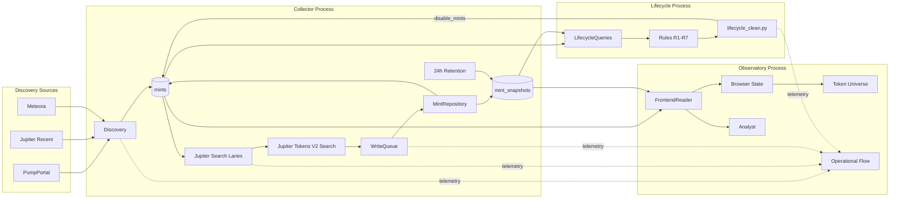
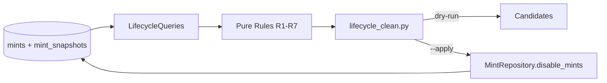

# Architecture

## Zweck

Dieses Dokument beschreibt die implementierte technische Architektur von `solana-token-observatory`: Runtime-Topologie, Datenfluss, Ownership und die Grenzen zwischen operativem Core und read-only Downstream.

Die fachliche Lifecycle-Semantik steht ausschließlich in [`LIFECYCLE_CONTRACT.md`](LIFECYCLE_CONTRACT.md). Der Frontend-/Analyst-/Telemetry-Vertrag steht ausschließlich in [`FRONTEND_OBSERVATORY.md`](FRONTEND_OBSERVATORY.md).

## Systemtopologie



## Runtime-Prozesse

| Prozess | Einstieg | Verantwortung |
|---|---|---|
| Collector | `python src/main.py run` | Discovery, Jupiter Observation, Persistence, Snapshot-Retention, Runtime-Telemetry |
| Lifecycle | `python src/lifecycle_clean.py --apply` | read-only Evidence-Auswahl, Rule-Evaluation, kontrolliertes `tracking_enabled=false` |
| Observatory | `python src/frontend.py` | read-only Projektion, Browser-Synchronisation, Telemetry-Visualisierung, Analyst |

Die Trennung ist absichtlich: Das Frontend besitzt keine Mutation-Authority; der Lifecycle ist nicht Teil der Discovery- oder Presentation-Logik.

## 1. Datenbank-Infrastruktur

`src/database.py` besitzt den process-wide PostgreSQL-ConnectionPool. Persistente Schemaänderungen erfolgen explizit über `src/schema.sql`; normale Runtime-Pfade führen keine versteckten Schema-Migrationen aus.

## 2. Discovery

`src/discovery.py` entdeckt neue Mint-Adressen aus:

- PumpPortal;
- Jupiter Recent;
- Meteora DAMM v2;
- Meteora DLMM.

Discovery beantwortet ausschließlich die Frage **„Welche Mint-Adressen sollen in die beobachtete Population aufgenommen werden?“**. Sie bewertet keine wirtschaftliche Qualität und trifft keine Lifecycle-Entscheidung.

Neue Kandidaten werden dedupliziert und über `MintRepository.insert_new_mints()` in `mints` aufgenommen. Eine dauerhafte Provenance-Relation `Discovery Source -> konkrete Mint` ist kein aktueller Architekturvertrag.

## 3. Jupiter Observation

`src/refresh.py` beobachtet aktive Mints über parallele Jupiter-Search-Lanes.

Der entscheidende Systemgrundsatz lautet:

> **Observation ist nicht Synchronisation.**

Vor einem HTTP-Request ist unbekannt, ob Jupiter für einen Mint inzwischen eine neue `updatedAt`-Version besitzt. Deshalb sind wiederholte Requests auf denselben Mint beabsichtigt.

```text
Jupiter Search response
        │
        ├── gleiche (mint, updatedAt)-Version
        │      -> erfolgreicher Poll
        │      -> last_polled_at fortschreiben
        │      -> kein redundanter Snapshot
        │
        └── neue updatedAt-Version
               -> Source-Version persistieren
               -> last_polled_at fortschreiben
               -> last_changed_at fortschreiben
               -> source_updated_at fortschreiben
```

Unveränderte Antworten sind damit operative Beobachtungen, aber keine neuen historischen Zustände.

### MintCache und BatchCursor

`MintCache` lädt die aktuell aktiven Mints einer Priority aus PostgreSQL. `BatchCursor` verteilt diese Population über die Search-Lanes. Diese Komponenten besitzen Scheduling-/Membership-Verantwortung, aber keine Daten- oder Lifecycle-Semantik.

### WriteQueue

Netzwerk-I/O und PostgreSQL-Writes sind getrennt. Erfolgreiche Search-Antworten gehen zunächst in die `WriteQueue`.

Innerhalb des Writer-Buffers dürfen identische `(mint, updatedAt)`-Beobachtungen zusammengefasst werden. Unterschiedliche tatsächlich beobachtete Source-Versionen eines Mints dürfen nicht verloren gehen.

## 4. Persistenz und Ownership

`src/repository.py` besitzt Collector-Persistenz und die ausdrücklich erlaubten operativen Mint-Mutationen.

### `mints`

`mints` ist die langlebige Registry der beobachteten Population. Relevante Zustände sind unter anderem:

- Mint-Identität und Metadaten;
- `tracking_enabled`;
- `priority`;
- `first_observed_at`;
- `last_polled_at`;
- `last_changed_at`;
- `source_updated_at`;
- `disabled_at`;
- `disabled_reason`.

### `mint_snapshots`

`mint_snapshots` enthält immutable, tatsächlich beobachtete Jupiter-Source-Versionen. Es ist kein vollständiges Poll-Log.

Die Tabelle dient als **24h Raw-Working-Buffer** für zeitliche Analyse und Lifecycle-Evidence. `src/maintenance.py` besitzt ausschließlich die gebatchte Retention; Retention selbst besitzt keine Lifecycle-Semantik.

### `lifecycle_rule_state`

`lifecycle_rule_state` enthält monotone Scan-Cursor für Lifecycle-Regeln, die historische Snapshot-Evidence schrittweise abarbeiten. Es ist kein Event Log und keine zweite Lifecycle-Historie.

## 5. Operational Lifecycle

Nur der definierte Lifecycle-Pfad darf aufgrund von Lifecycle-Regeln `tracking_enabled=false` setzen.



Ownership:

- `src/lifecycle_queries.py` — read-only Evidence-Auswahl;
- `src/lifecycle_rules.py` — reine Regelentscheidungen;
- `src/lifecycle_clean.py` — Reihenfolge, First-match, Dry-Run/Apply und Orchestrierung;
- `MintRepository.disable_mints()` — operative Mutation.

Die exakten Thresholds, Zeitfenster, T0-Begriffe, Missing-Semantik und Disable-Reasons stehen in [`LIFECYCLE_CONTRACT.md`](LIFECYCLE_CONTRACT.md).

## 6. Read-only Downstream Boundary

Observatory, Analyst und Telemetry dürfen operative Daten lesen und eigene Projektionen oder Interpretationen erzeugen. Sie dürfen weder Tracking, Priority, Collector-Timestamps noch Lifecycle-State verändern.

Diese Grenze verhindert, dass Presentation, externe Evidence oder probabilistische LLM-Interpretation operative System Truth erzeugen.

## 7. Observatory und Browser State

`src/observatory/` ist ein separater read-only Consumer.

`FrontendReader` erzeugt die Browser-Projektion aus PostgreSQL. Der Browser besitzt genau eine kanonische aktive Population und einen gemeinsamen `selectedMint`.

`/api/events` ist die autoritative Population-Synchronisationsgrenze:

```text
connect / reconnect
      ↓
universe_snapshot
      ↓
universe_delta*
```

Delta-Typen sind `token_added`, `token_updated` und `token_retired`.

Konkrete Bubble-Positionen, Radien, Farben, Halos, Animationen und Canvas-Zustände sind Presentation und keine Domain-Authority.

## 8. Runtime Telemetry

Collector und Lifecycle emittieren kleine best-effort Runtime-Events über localhost UDP. Das Observatory hält diese Events in einem begrenzten RAM-Buffer und projiziert sie in den Operational Flow.

Aktuelle Event-Typen:

- `discovery_tick`;
- `search_lane_tick`;
- `search_flush`;
- `lifecycle_tick`.

Telemetry besitzt bewusst:

- keine DB-/Disk-Persistenz;
- keine API Keys;
- keine Mint-Listen;
- keine Mutation;
- keinen Anspruch auf Event-Sourcing-Vollständigkeit.

## 9. Analyst und External Evidence

Der Analyst ist read-only und besitzt vier getrennte Use Cases: `current_data`, `web`, `temporal` und `rugcheck`.

Systemdaten, deterministische Ableitungen, Runtime-Telemetry, externe Evidence und LLM-Interpretation bleiben getrennte Truth-Klassen. Eine schwächere Klasse darf nicht stillschweigend zur operativen Truth hochgestuft werden.

Detailverträge stehen in [`FRONTEND_OBSERVATORY.md`](FRONTEND_OBSERVATORY.md).

## Stabile Invarianten

- Discovery entdeckt Mints; sie deaktiviert keine Tokens.
- Jupiter Search ist die operative Quelle der gespeicherten Token-Zustände.
- Poll und Snapshot sind unterschiedliche Ereignisse.
- Unterschiedliche beobachtete Jupiter-Source-Versionen dürfen nicht verloren gehen.
- `missing` oder `unknown` ist nicht numerische Null.
- Nur der Lifecycle besitzt Hard-Retire-Authority.
- Snapshot-Retention besitzt keine Lifecycle-Semantik.
- Observatory, Analyst und Telemetry bleiben read-only.
- External Evidence bleibt externe Evidence.
- LLM-Interpretation besitzt keine operative Authority.

## Source Map

| Verantwortung | Implementierung |
|---|---|
| Runtime configuration | `src/config.py` |
| PostgreSQL infrastructure | `src/database.py` |
| Discovery | `src/discovery.py` |
| Jupiter observation / WriteQueue | `src/refresh.py` |
| Persistence / operative Mint-Mutationen | `src/repository.py` |
| Raw snapshot retention | `src/maintenance.py` |
| Runtime telemetry producer | `src/telemetry.py` |
| Lifecycle evidence | `src/lifecycle_queries.py` |
| Lifecycle decisions | `src/lifecycle_rules.py` |
| Lifecycle orchestration | `src/lifecycle_clean.py` |
| Temporal deterministic context | `src/temporal_context.py` |
| Observatory application | `src/observatory/app.py` |
| Observatory DB projection | `src/observatory/data.py` |
| Analyst | `src/observatory/analyst.py` |
| Observatory telemetry receiver | `src/observatory/telemetry.py` |

## Authority-Modell

| Frage | Authority |
|---|---|
| Was ist das Projekt und wie wird es betrieben? | `README.md` |
| Wie fließen Daten und wer besitzt welche technische Verantwortung? | `docs/architecture.md` |
| Welche Lifecycle-Regeln gelten exakt? | `docs/LIFECYCLE_CONTRACT.md` |
| Welche Observatory-/Analyst-/Telemetry-Grenzen gelten? | `docs/FRONTEND_OBSERVATORY.md` |
| Welche Regeln gelten für Änderungen? | `AGENTS.md` |

Offene Arbeit wird in GitHub Issues geführt; Änderungshistorie in Git.