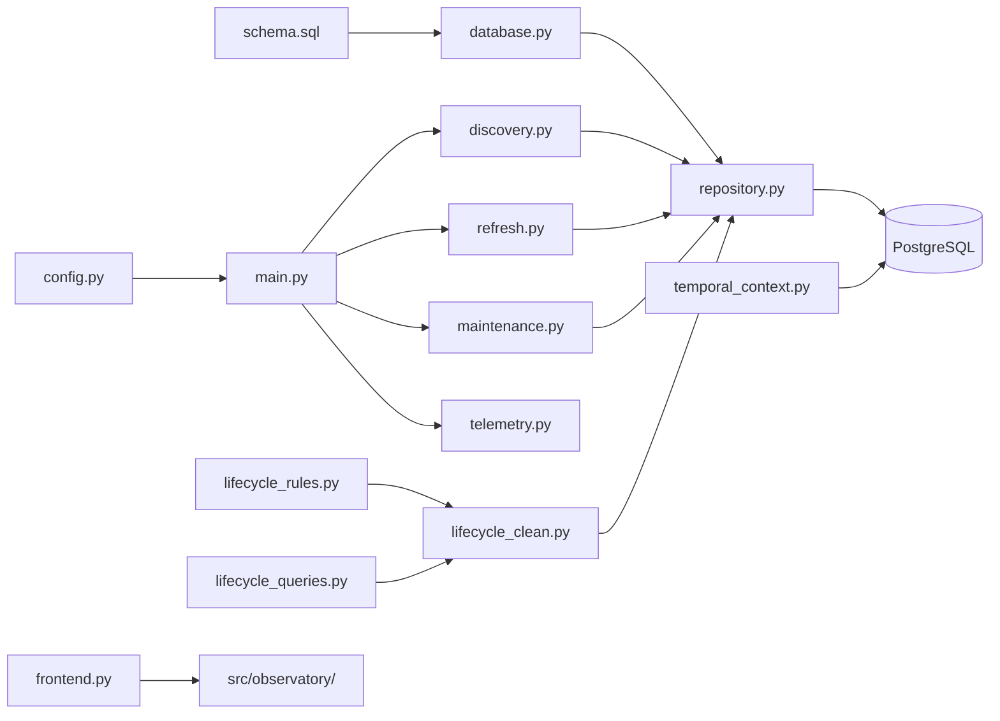

# Backend Script Memos

Diese Memos sind eine **präsentationsorientierte Vogelperspektive** auf alle Dateien direkt unter `src/` — mit Ausnahme des Ordners `src/observatory/`.

Sie ersetzen **nicht** die verbindlichen Architektur- und Fachverträge. Für technische Authority gelten weiterhin insbesondere [`docs/architecture.md`](../architecture.md), [`docs/LIFECYCLE_CONTRACT.md`](../LIFECYCLE_CONTRACT.md) und [`docs/FRONTEND_OBSERVATORY.md`](../FRONTEND_OBSERVATORY.md).

## Empfohlene Reihenfolge

1. [`schema.sql`](schema.md) — Welche Daten hält PostgreSQL?
2. [`config.py`](config.md) — Woher kommen Runtime-Einstellungen und Secrets?
3. [`database.py`](database.md) — Wie bekommt Python kontrollierten PostgreSQL-Zugriff?
4. [`repository.py`](repository.md) — Wie werden Mints, Snapshots und Tracking-State persistiert?
5. [`main.py`](main.md) — Welche Backend-Loops werden gemeinsam gestartet?
6. [`discovery.py`](discovery.md) — Wie gelangen neue Mint-Adressen in die Population?
7. [`refresh.py`](refresh.md) — Wie wird die aktive Population kontinuierlich und skalierbar bei Jupiter abgefragt?
8. [`telemetry.py`](telemetry.md) — Wie beobachtet sich der operative Core selbst?
9. [`maintenance.py`](maintenance.md) — Wie bleibt die Raw-History auf 24 Stunden begrenzt?
10. [`lifecycle_rules.py`](lifecycle_rules.md) — Welche fachlichen Retirement-Regeln existieren?
11. [`lifecycle_queries.py`](lifecycle_queries.md) — Welche Evidence wird für diese Regeln aus PostgreSQL gelesen?
12. [`lifecycle_clean.py`](lifecycle_clean.md) — Wie werden Evidence, Regeln und Mutation orchestriert?
13. [`temporal_context.py`](temporal_context.md) — Wie wird Snapshot-Historie zu einem kompakten zeitlichen Summary verdichtet?
14. [`frontend.py`](frontend.md) — Wie wird der Observatory-Backend-Server gestartet?

## Gesamtbild

## Präsentationslogik

Für jede Datei reicht im Vortrag normalerweise diese Reihenfolge:

1. **Aufgabe:** Wofür existiert die Datei?
2. **Bird's-Eye-View:** Wo liegt sie im Datenfluss?
3. **Funktionen:** Was leisten die einzelnen Funktionen grob?
4. **Aufgerufen von / genutzt von:** Wer verwendet diese Schnittstelle?
5. **Präsentationssatz:** Ein Satz, der die Datei zusammenfasst.
