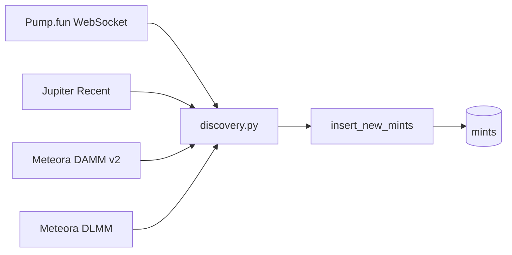

# `src/discovery.py`

## Aufgabe

`discovery.py` findet neue Solana-Mint-Adressen aus mehreren Quellen und übergibt sie an `MintRepository.insert_new_mints()`. Die Datei entscheidet noch nicht, ob ein Token interessant oder wertvoll ist — sie erweitert nur die Kandidatenpopulation.

[Quellcode](../../src/discovery.py)

## Bird's-Eye-View

## `_meteora_mints(pools)`

Extrahiert aus Meteora-Pools die Mint-Adressen beider Token-Seiten (`token_x` und `token_y`). Die Hilfsfunktion normalisiert damit die Pool-Antwort auf genau die Information, die Discovery benötigt: Mint-Adressen.

**Genutzt von:** `meteora_damm_v2_loop()` und `meteora_dlmm_loop()`.

## `_emit_discovery(...)`

Baut einen einheitlichen `discovery_tick` für die Telemetrie. Erfasst werden unter anderem Quelle, HTTP-Status, Anzahl Antworten, Kandidaten, neue Mints und Latenz.

**Genutzt von:** allen vier Discovery-Loops.

## `jupiter_recent_loop(...)`

Fragt kontinuierlich den Jupiter-Recent-Endpoint ab, extrahiert die `id`-Felder und übergibt die Mints an das Repository. Das Intervall orientiert sich am konfigurierten Jupiter-Rate-Limit pro Key.

**Gestartet von:** `main.py` / `run()`.

## `meteora_damm_v2_loop(...)`

Fragt regelmäßig die neuesten Meteora-DAMM-v2-Pools ab. Aus den Pools werden beide Token-Mints extrahiert und idempotent in die gemeinsame Population aufgenommen.

**Gestartet von:** `main.py` / `run()`.

## `meteora_dlmm_loop(...)`

Fragt Meteora-DLMM mit mehreren Sortierungen ab: TVL, 24h Fees und 24h Volume. Dadurch sieht Discovery unterschiedliche relevante Ausschnitte der Pool-Population, ohne dafür unterschiedliche Persistenzpfade zu benötigen.

**Gestartet von:** `main.py` / `run()`.

## `pump_loop(...)`

Hält eine WebSocket-Verbindung zu PumpPortal offen und abonniert neue Pump.fun-Tokens. Neue Mint-Adressen werden kurz gepuffert und gebündelt ins Repository geschrieben; bei Verbindungsfehlern wird mit wachsendem Reconnect-Delay erneut verbunden.

**Gestartet von:** `main.py` / `run()`.

## Wichtige Kreuzverbindung

Discovery schreibt nur minimale Mint-Identität in `mints`. Die vollständigen Jupiter-Daten kommen erst später über `refresh.py` und `repository.store_tokens_grouped()` hinzu.

## Präsentationssatz

> **`discovery.py` vereint mehrere externe Quellen auf eine gemeinsame Identität — die Solana-Mint-Adresse — und speist neue Kandidaten idempotent in die aktive Monitoring-Population ein.**
