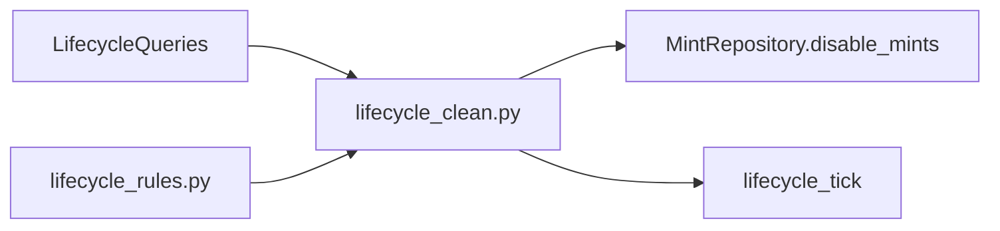

# `src/lifecycle_clean.py`

## Aufgabe

`lifecycle_clean.py` ist der Orchestrator der Hard-Retire-Engine. Die Datei lädt Evidence über `LifecycleQueries`, lässt sie von `lifecycle_rules.py` klassifizieren und setzt Treffer über `MintRepository.disable_mints()` um.

[Quellcode](../../src/lifecycle_clean.py)

## Bird's-Eye-View

## `parse_args()`

Definiert die CLI-Flags `--apply` und `--once`. Ohne `--apply` läuft die Engine als Dry-Run; mit `--once` wird genau ein Zyklus ausgeführt statt dauerhaft alle 15 Sekunden zu wiederholen.

**Genutzt von:** `main()` dieser Datei.

## `_act(repository, candidates, apply)`

Ist die schmale Mutationsgrenze des Lifecycle-Zyklus. Im Dry-Run werden Kandidaten nur zurückgegeben; im Apply-Modus werden sie über `repository.disable_mints()` tatsächlich deaktiviert.

**Genutzt von:** `run_cycle()` für jede Regel.

## `run_cycle(repository, queries, apply)`

Führt Rule 1 bis Rule 7 in definierter Reihenfolge aus. Pro Regel wird die passende Evidence geladen, klassifiziert und optional angewendet; `already_flagged` verhindert, dass dieselbe Mint im selben Zyklus mehrfach verschiedenen Regeln zugerechnet wird.

Rule 4 und Rule 5 verwenden zusätzlich die inkrementellen Scan-Cursor aus `lifecycle_queries.py`. Am Ende liefert die Funktion Breakdown, Gesamtzahl betroffener Tokens und die verbleibende aktive Population.

**Aufgerufen von:** `main()` in jedem Lifecycle-Zyklus.

## `print_result(result)`

Gibt das Ergebnis eines Zyklus kompakt im Terminal aus: Dry-Run oder Apply, Anzahl Kandidaten beziehungsweise Deaktivierungen, Breakdown pro Regel und verbleibende aktive Mints.

**Genutzt von:** `main()`.

## `main()`

Lädt Konfiguration, Telemetrie und Datenbank, baut `MintRepository` und `LifecycleQueries` auf und startet die Lifecycle-Schleife. Nach jedem Zyklus wird ein `lifecycle_tick` emittiert; mit `--once` endet der Prozess nach dem ersten Durchlauf.

**Aufgerufen von:** direkt über `python src/lifecycle_clean.py ...`.

## Wichtige Kreuzverbindung

Der Lifecycle läuft als separater Prozess neben `src/main.py`. Die Kopplung erfolgt nicht über direkte Funktionsaufrufe, sondern über den gemeinsamen PostgreSQL-Zustand: Deaktivierte Mints verschwinden beim nächsten `MintCache`-Refresh automatisch aus der Search-Population.

## Präsentationssatz

> **`lifecycle_clean.py` verbindet Evidence, Regeln und Mutation: Es orchestriert die sieben Retirement-Regeln, kann sie zuerst im Dry-Run prüfen und entfernt Treffer anschließend nachvollziehbar aus der aktiven Monitoring-Population.**
